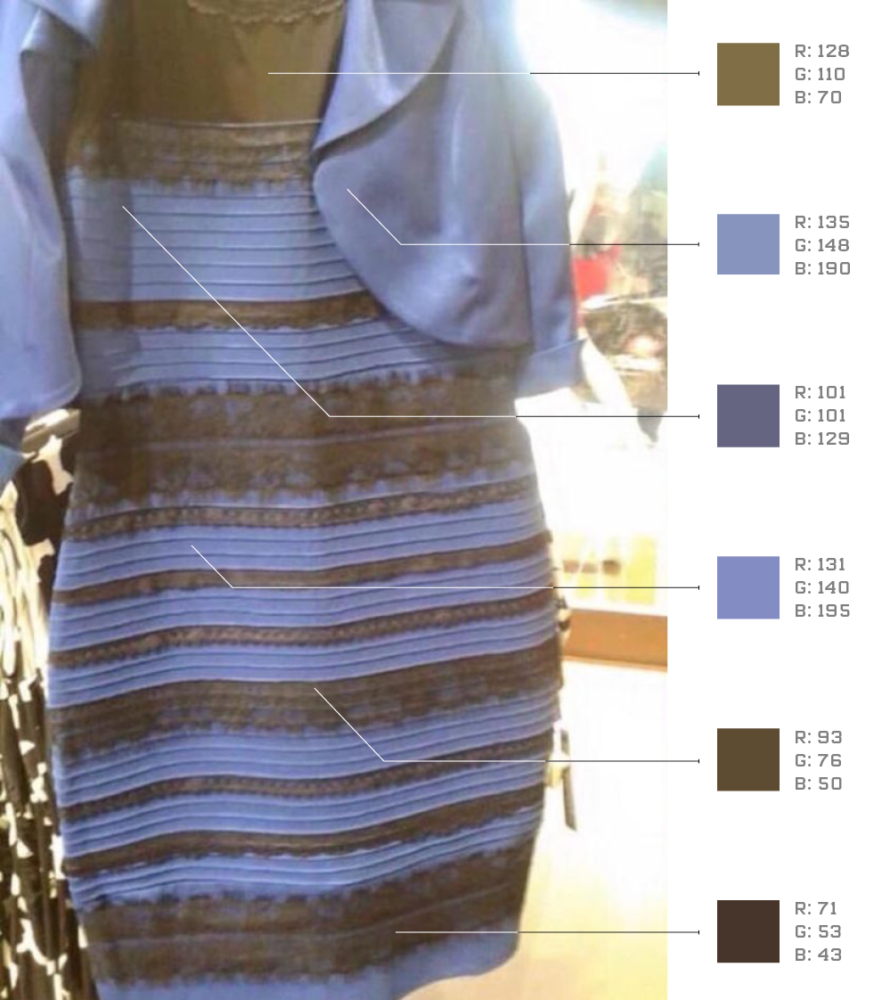
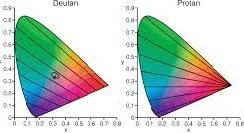

Colour is not always as simple as it looks. Like many aspects of our perception and even memory, colours are  shoehorned by our visual system to fit the context in which we see them. That shoehorning process changes how colours look. The blue/yellow dress debate is a classic example. Colours will look different depending on the colour that surrounds them, the light that falls on them, or colours that you have looked at immediately before or with your memory of what an object should be coloured.

photo credit : [link](http://wired.com) 

So colour is rarely fixed but some people’s eyes are structurally different in the way they discern colour and can have an impact on everyday life, like choosing clothes or picking ripe fruit.

The vast majority of the time this is down to a genetic abnormality that alters the proportions of the 3 different photoreceptor pigments in the back of the eye that are used to tell the difference between colours. The photoreceptors are wired in opposition - red vs green, blue vs yellow  =red+green. In genetic colour deficiency either the red -protan, or the green -deutan photoreceptors are affected making it harder to see the difference between red and green, and shades of colours related to these. 

To the right is a colour confusion diagram. This demonstrates the extreme cases but allows easier understanding of abnormal colour vision - colours along each line will look the same:

Development of and differences in color vision. (2015). In A. Elliot, M. Fairchild, & A. Franklin (Eds.), Handbook of Color Psychology (Cambridge Handbooks in Psychology, pp. 131-146). Cambridge: Cambridge University Press.

The red-green colour gene is on the X chromosome so affects mostly males (8%) and females only in rare cases (0.4%). An affected male will pass on the gene so that all daughters are carriers but no sons are affected. Then 50% of the carrier’s sons will be affected and 50% of the carrier’s daughters will also be carriers.

photo credit : [link](http://colourblindnesss.weebly.com)

There is no cure for congenital colour vision deficiencies but they also often don’t cause significant problems in day to day life. Congenital colour vision deficiencies can span the spectrum of very mild to profound with 25% of people with colour vision deficiencies not aware of their condition. 

It is possible to aid a severe colour vision deficient person to tell the difference between two colours that to them would normally look the same, by using tinted lenses. These have 2 forms - either using a single colour filter over one eye and using the brightness difference perceived by each eye to discern the difference between colours or a using special filter that blocks very specific colours from the spectrum to  make the difference between nearby colours wider. Both of these options make the two shades appear to have different brightnesses by subtracting specific colours. The colours won’t look the same as if a non-colour vision deficient person saw them, but one will look brighter and one will look darker. Normal colour vision is not regained but this can be useful for situations where it is important to discern particular shades. 

Knowing your colour vision status can be an important factor in certain occupational pursuits including police, fire, transport, armed services, electrical, printing, art, textile, paint and to a lesser extent, horticulture, cartography, histopathology and pharmacy. It may be important to know whether the red protanomaly or green deuteranomaly photopigment is faulty for certain careers such as the police force as protanomaly see significantly less hues than deuteranomaly.

Apart from colour vision deficiencies present from birth, changes to colour vision can occur due to eye disease. Acquired deficiencies tend to affect perception of greens and blues but may also affect reds. These changes can be caused by a range of conditions affecting the retina or the optic nerve. Although these are an important symptom, colour vision changes are often not more useful for diagnosis of eye disease than other tests.

At Innovative Eye Care we have a range of colour vision tests to diagnose and grade colour vision deficiencies: Ishihara plates, Farnsworth D15, Farnsworth-Munsell F28 and Medmont C100. Determining a protanomaly from a deuteranomaly can only be done confidently with a few instruments of which the Medmont C-100 is one, so this is a service we can provide. Some occupations require colour vision grading which can be performed with a combination of the D15 and F28.
