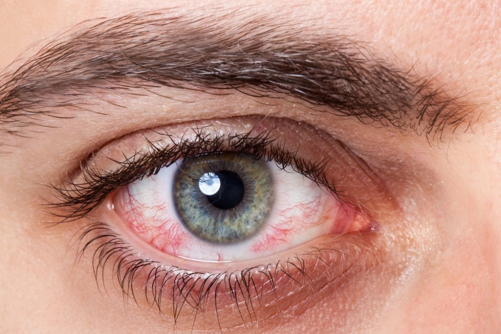

Dry eye disease covers a spectrum of conditions. Symptoms include dry, stinging, burning eyes, inflammation, irritation and redness, excessive tearing and foreign body sensation. This can be extremely debilitating in the day-to-day lives of sufferers. Left untreated, there is risk of permanent damage to the ocular surface and ​eyelids.

#### What causes dry eye disease?
The tear film is made up of three layers: the mucin (mucous) layer, ​the ​watery ​aqueous ​layer ​and ​the ​oily ​lipid ​layer. Specialised cells (such as goblet cells) embedded throughout the surface of the eye create the mucin layer. The lacrimal gland under the bony aspect of the eyebrow secretes the watery aqueous layer. The meibomian glands in the upper ​and ​lower ​eyelids ​secrete ​oil ​to ​make ​up ​the ​lipid ​layer. In most dry eye cases, the watery aqueous layer is produced at normal quantities but quickly evaporates. This is called evaporative dry eye. There are three main causes: blepharitis, meibomian gland dysfunction and environmental ​factors.

- Blepharitis is inflammation of the eyelid margins. This is a chronic condition that arises from overpopulation
of ​bacteria ​and ​mites ​(Demodex) ​along ​the ​eyelid ​margin ​and ​within ​eyelash ​follicles.
- Meibomian ​Gland ​Dysfunction ​(MGD) ​is ​when ​the ​oil-producing ​meibomian ​glands ​stop working properly.
This ​diminishes ​the ​lipid ​layer ​of ​the ​tear ​film, ​causing ​aqueous ​tears ​to ​quickly ​evaporate.
- Environmental factors such as air conditioning, extended screen time or wind can result in excessive tear
evaporation, ​leading ​to ​dryness ​and ​irritation.

Severe cases of dry eye are due to low production of tears, referred to as aqueous deficient dry eye. This is far less ​common ​than ​evaporative ​dry ​eye, ​and ​is ​usually ​due ​to ​autoimmune ​disease, ​medication ​or ​eye ​surgery.

 

### Treatments and Care
Fortunately, dry eye disease can be treated. With appropriate care, comfortable and well-lubricated eyes can be achieved, restoring quality of life. Lubricating eye drops alone are not an effective treatment for the majority of cases. Dry eye disease is best treated with a comprehensive management system which involves restoring
proper function to meibomian glands, maintaining good eyelid hygiene, protecting the eyes, and using lubricants.

##### Lubricants
Lubricating drops replenish the deficient tear film and are an essential component of dry eye disease management. Most dry eye disease patients will always need to use some form of ocular lubricant for comfort and eye health. There are many different eye drops with varied compositions and ingredients. Gel-like, viscous drops provide longer contact time on the eye for more sustained lubrication and less frequent application. Preservative free drops are ​essential ​to ​avoid ​further ​aggravation ​of ​the ​inflamed ​ocular ​surface.

##### Nutrition
Omega 3 essential fatty acids are necessary for overall health of the body, and thought to assist the meibomian and lacrimal glands in oil and tear fluid production. Meibomian glands in particular require essential fatty acids to produce the lipid layer. They are found in all fish and shellfish, and some plant foods such as flaxseed. A
targeted vitamin supplement ensures the right amount of omega-3 fatty acids are consumed. It can be a valuable ​complement ​to ​topical ​treatments.

##### Heat and Massage
A hot compress helps to clear blocked meibomian glands by liquefying the thickened oil inside. The glands need to be heated for 10 mins, followed by 1 minute of blink training. Performed regularly, this process helps to maintain ​regular ​function ​of ​the ​glands ​for ​an ​adequate ​protective ​lipid ​layer.

##### Blink Training
Proper blinking keeps your tears healthy by releasing and spreading oil from eyelid glands into the tears. When your tears are healthy, they stabilise your vision and protect you from eye infections and eye discomfort. Poor blinking can easily lead to an unhealthy tear film but blinking exercises are practical and effective - the blinking exercise that follows is an improvement and simplification of those recommended by eye doctors for 30 years.

##### Eyelid Hygiene
It is important for patients with dry eye disease to maintain good lid hygiene. Antibacterial lid foams cleanse the eyelids and lashes while conditioning the skin around the eyes. This procedure can be performed most effectively at the clinic with a specialised ‘BlephEx’ tool for deep eyelid cleaning. This is important for managing, ​treating ​or ​preventing ​anterior ​blepharitis, ​reducing ​further ​irritation ​of ​the ​eyes.

##### IPL
Innovative Eye Care is the first practice in South Australia to offer Intense Pulsed Light ​(IPL) ​treatments ​for ​dry ​eye ​disease! IPL technology generates an intense pulsed light directed at the lower eyelid, reducing inflammation and stimulating the meibomian glands to return to their normal function. Four treatments are recommended to best manage MGD. These are performed over a 10 week ​period. ​Ask ​our ​optometrists ​if ​IPL ​is ​for ​you.

##### Manuka Honey
Medical grade manuka honey is antibacterial and has been shown to be quite effective in improving the health of the eyelids and therefore the meibomian glands within the lids. Honey is mildly acidic in nature - which doesn’t ​cause ​damage ​- ​but ​may ​cause ​temporary ​stinging ​and ​redness ​on ​application.

##### Anti Inflammatories
Inflammation and dry eye disease are like the chicken or the egg metaphor, in that they form a cycle in which we don’t know which comes first. Anti-inflammatory drops are used in some cases to break the cycle and allow other ​therapies ​to ​work.

##### Oral Medications
Low dose antibiotic tablets prescribed in conjunction with your GP can be effective in controlling the deeper inflammation ​within ​the ​meibomian ​glands.

##### Sunglasses
Sunglasses are crucial for all of us to wear, but have even more benefits for those with dry eye disease. Along with 100% UV protection and polarised coatings to reduce discomfort from glare, ​sunglasses ​keep ​eyes ​sheltered ​from ​the ​drying ​effects ​of ​the ​wind ​and ​other ​irritants.

 

### Further Information

##### IPL
Contact us for more information regarding our E-Eye IPL treatment sessions for meibomian ​gland ​dysfunction. IPL ​Single ​Sessions: ​$200 ​(Concession ​discount: ​$25 ​per ​single ​session)

##### Blink Training
Meibomian glands, found in your upper and lower eyelids, hold oil (lipids) that are essential to eye health. When we blink, the closing of our eyelids generates an oil expression of the meibomian glands. Blinking releases complex natural lipids that stabilise the tears and protects the ocular surface. The lipid layer is the front line of defence for the eye and ocular surface. If the lipid layer is compromised, the entire tear film and ocular surface are at risk. Having a lipid layer over the eye also generates a stable tear film, which is essential to clear vision and comfort. Often patients experience sensations of burning, dryness, and irritation due to a less than ideal lipid layer caused by poor blinking habits. To avoid all of the above correct blinking is a simple function to master ​to ​prevent ​rapid ​evaporation ​of ​tears.

##### Does it work?
The majority of the time proactive patients will see results. Blinking exercises will result in reduced eye discomfort and improved ocular surface health. Impress your optometrist by being diligent; do your exercises as prescribed ​and ​improvements ​should ​be ​evident ​at ​your ​next ​appointment.

##### What else can I do?
Think blink! Consider your environment and the times of day you find your eyes most uncomfortable. For example: pay attention to blinking when working on a computer or smartphone or take a moment to do your blink ​exercises ​if ​you ​start ​to ​experience ​discomfort.

#### Blink Exercise
Open ​eyes. ​Count ​1 ​, ​2.
Close ​eyes. ​Count ​1, ​2.
Squeeze ​eyes. ​Count ​1, ​2.
Open ​eyes. ​Count ​1 ​, ​2.
Close ​eyes. ​Count ​1, ​2.
Squeeze ​eyes. ​Count ​1, ​2.
Repeat ​for ​1 ​minute

