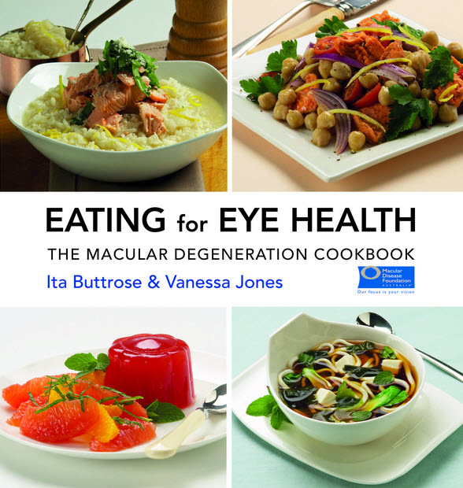

Nutrition plays an important role in optimising retinal health and reducing the risk of macular degeneration. Eating a healthy, well-balanced diet which includes eye health foods will be good for overall wellbeing as well as eye health. For some people an appropriate supplement may also be an important consideration. See our store for cookbooks incorporating ingredients proven to aid eye health.

# Key eye health practices

Adopting these simple practices as a normal part of your diet can help reduce the risk of macular degeneration, whether or not you have been diagnosed with the disease. 

  * Eat a healthy, well-balanced diet 
  * Eat dark green leafy vegetables and fresh fruit daily. 
  * Eat fish two to three times a week 
  * Choose low glycemic index (low GI) carbohydrates instead of high GI 
  * Eat a handful of nuts a week 
  * Limit the intake of fats and oils 
  * Keep a healthy lifestyle - maintain a healthy weight, and exercise regularly 
  * Consider taking a suitable supplement in consultation with your doctor/optometrist.

# Nutrition for eye health

A diet rich in lutein and omega-3 is important for good macular health. If your diet is lacking in these nutrients you might consider taking a supplement.

#### Lutein and zeaxanthin

Lutein and zeaxanthin are particularly important nutrients for the macula and are present in high concentrations in a healthy macula. Lutein and zeaxanthin are found in particularly high levels in dark green leafy vegetables such as kale, spinach and silver beet. They are also present in a range of other vegetables such as peas, pumpkin, Brussels sprouts, broccoli, corn and beans.

#### Omega-3

Omega-3 fatty acids are important to eye health. All fish and shellfish contain omega- 3s but higher concentrations are found in oily varieties of fish such as salmon, mackerel, anchovies, trout, herring and sardines (and tuna to a lesser degree). Eat fish or seafood 2-3 times per week either fresh, frozen or tinned.

#### Carbohydrates and glycemic index

The glycemic index is a ranking of carbohydrates on a scale of 1 to 100 according to how much they raise blood sugar after eating. There is now good evidence that those who eat a higher proportion of carbohydrates with a low glycemicinde x (GI) compared to a high GI, have a lower risk of developing macular degeneration.

Carbohydrates with a high GI are digested rapidly and produce a large and rapid rise in blood sugar. Low GI carbohydrates are digested more slowly, giving a more gradual but longer release of energy. Low GI foods have proven benefits for health. Low GI foods include most fruit and vegetables, whole grain cereals and whole grain breads and legumes. Glycemic index only applies to carbohydrates so protein and dairy (eg meat, fish, eggs, cheese) do not have a glycemic index. People who have low GI diets tend to have less heart disease, lower cholesterol, less obesity, less diabetes and also less macular degeneration.

# Supplements for macula health

Supplements are vitamins, minerals or other substances taken in tablet form. The use of supplements for macula health are broadly divided into two areas: 

  * Supplementing the diet: if dietary intake of nutrients, particularly eye health nutrients, is inadequate a supplement may be considered. This can be appropriate whether or not you have been diagnosed with macular degeneration. 
  * AREDS2-based supplements: for those diagnosed with age-related macular degeneration (AMD), a supplement based on the Age-Related Eye Disease Study #2 may be considered.

It is important to speak to a health care professional about the most appropriate supplement for your individual needs.

#### Lutein supplement

Lutein is a particularly important antioxidant for eye health. If you are over 50 or have a family history of AMD, and are not eating sufficient dark green leafy vegetables, a lutein supplement may be appropriate. A daily lutein intake of 6 - 10mg from a supplement is generally considered adequate.

#### Omega-3 supplement

There is a substantial body of evidence supporting the consumption of actual fish (2-3 serves per week) to reduce the risk of AMD. If you eat adequate fish, current evidence shows that a fish oil supplement provides no additional benefit. If you do not eat 2-3 serves of fish per week, a fish oil supplement may, on balance, be worth consideration. However, there is a lack of evidence from large randomised trials to confirm this. As fish oil may also be beneficial for other medical conditions, you should discuss this with your doctor.

#### AREDS2 supplements

People who have been diagnosed with AMD should consider taking a supplement based on the AREDS formula. The Age-Related Eye Disease Studies (AREDS) are the only studies for which there is good, long-term evidence for the benefits of high dose nutrients for people diagnosed with AMD.

The original AREDS study showed that a supplement based on a specific formula of zinc and antioxidants slowed the progression of AMD; for people in the intermediate stage of AMD in one or both eyes, or in the late stage in one eye, the AREDS formula reduced the risk of progression of the disease by 20 to 25% and delayed vision loss.

The AREDS study showed that the formula had no effect on those with no AMD, or only very early signs of AMD (eg a few small drusen), or for those with advanced disease in both eyes.

In May 2013, the AREDS researchers announced the results of their follow-up study, AREDS2. Their recommendation was the continued use of the original AREDS formulation, but with beta-carotene removed, to be replaced by lutein/zeaxanthin. Supplements are not a cure for macular degeneration. The AREDS study shows that taking the AREDS formula may reduce the risk of progression; it does not stop or reverse damage caused by the disease.

The AREDS2 formula (daily dose) is:

  * Zinc (as zinc oxide) 80 mg
  * Vitamin C 500 mg
  * Vitamin E 400 IU
  * Copper (as cupric oxide) 2 mg
  * Lutein 10 mg
  * Zeaxanthin 2 mg

# What products conform to AREDS2?

There are a number of supplements available reflecting the AREDS2 formula. Check the label and ensure the product contains the correct ingredients in the correct ratio from the AREDS2 study. Innovative Eye Care currently has the Blackmores Macuvision family of tablets available from our [online shop](http://eyesolutions.com.au/collections/nutrition/products/blackmores-macu-vision) and in store.

# The correct dose to match AREDS2

Due to current regulations, the label on Macuvision will typically say “take 1 tablet per day or as professionally prescribed”. However, typically more than 1 tablet is required to get the AREDS2 dose so please consult your doctor/optometrist. (Note that it is impractical to obtain the level of AREDS2 nutrients through diet alone. For example, to get the same quantity of zinc you would need to eat around 135g of oysters each day!)

# AREDS2 for no or early signs of AMD?

The AREDS study showed that the formula had no effect on those with no AMD, or only very early signs of AMD (eg a few small drusen). For such people, an optimal eye health diet is more appropriate.

# Frequently Asked Questions

<b><i>Is there a need to be careful with leafy greens and certain medications?</i></b>

Most of the best natural sources of lutein, including kale, spinach, silver beet, Brussels sprouts and broccoli also contain high levels of vitamin k which can interfere with the function of some medications including the blood thinner, warfarin. That is why it is important to speak to your doctor before making changes to your diet, especially for those on warfarin. If enough lutein cannot be obtained from a natural diet, then lutein supplement should be considered.

<b><i>Are carrots the best food for your eyes?</i></b>

Carrots are a good source of vitamin A, which is important for general health. However, they are not the best eye food that the popular myth suggests. Choose dark green leafy vegetables as the main eye health vegetable and carrots in moderation as a part of a balanced diet.

<b><i>Does food have to be fresh?</i></b>

No. Frozen or tinned food, such as fish or vegetables, is a very good and convenient option if the fresh alternative is not readily available.

<b><i>Which nuts should be eaten?</i></b>

A handful of nuts each week (or a few nuts each day) is a good addition to any balanced diet. Choose raw, unsalted nuts and mix a selection such as almonds, walnuts, brazil nuts, pine nuts, pecans and pistachios.

<b><i>What about seeds?</i></b>

Seeds such a flax seeds (linseeds) are often recommended by nutritionists for their high essential fatty acid content. However, their relationship to macular degeneration has not been studied.

<b><i>I heard margarine is bad for your eyes. Is this true?</i></b>

Limiting the intake of fats and oils is recommended as part of a general healthy approach to diet. In Australia, doctors disagree about the role of margarine and oils in relation to macular degeneration. However, recent research shows that those who consume one tablespoon of olive oil per day are less likely to develop late stage age-related macular degeneration. More research is required in the area of fats and oils and macular degeneration.

<b><i>What about alcohol?</i></b>

As a part of a healthy diet, excessive consumption of alcohol should be avoided and no more than two standard drinks per day is recommended.

Information from Macula Degeneration Foundation Australia (www.mdfoundation.com.au)
