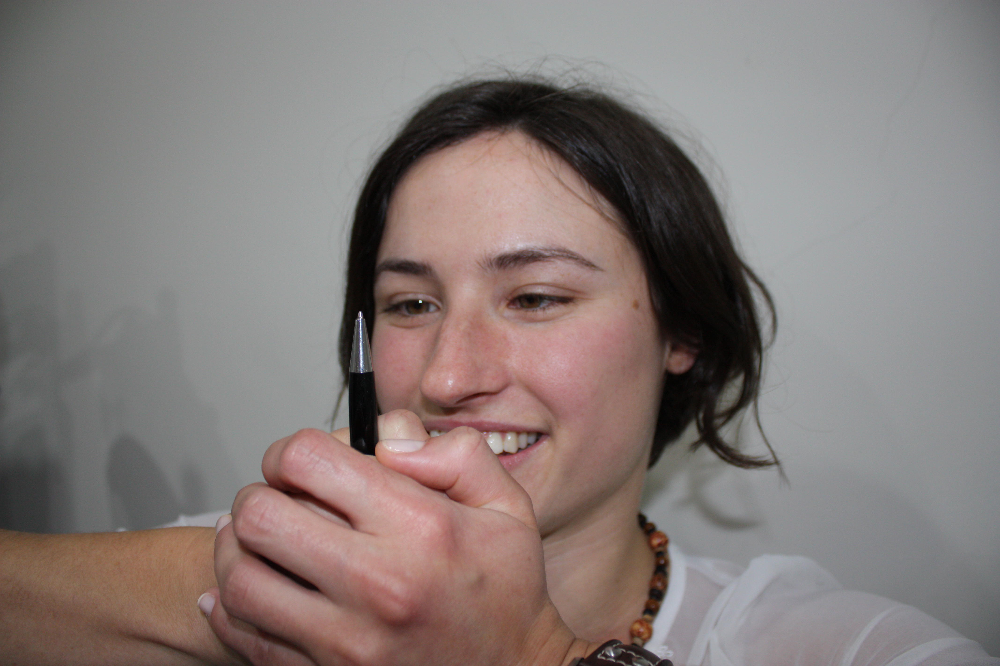
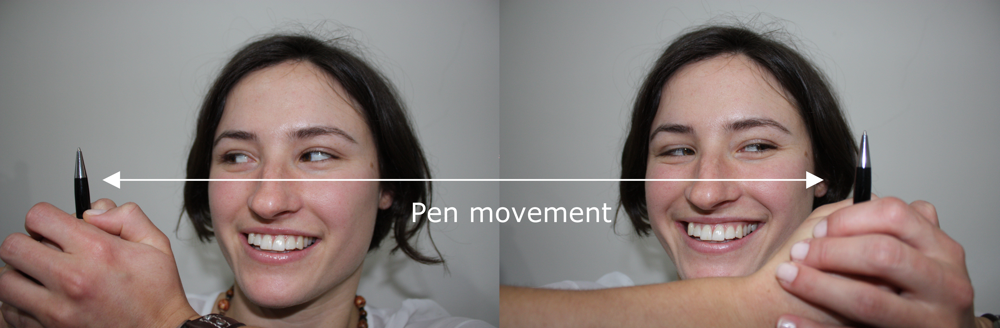
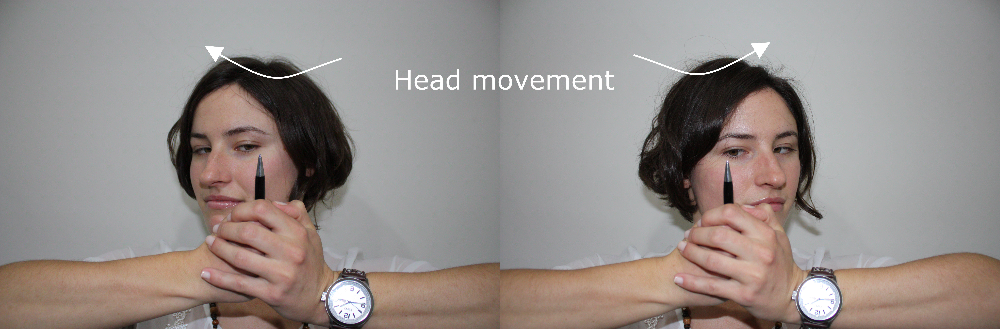

## What is this exercise for?

This exercise helps to train convergence and visual tracking. Convergence is when the both eyes move in (towards the nose) as we follow an object coming towards us. If our eyes do not converge, the near object will be seen as two (or doubled). For any reading or computer task we are converging the eyes different amounts to keep the image single. Accommodation (focusing clearly on a close object) is linked to convergence as we have to keep the object not only single, but also clear. Problems with convergence can lead to double vision, blur, eye-strain, headache or fatigue when reading or doing close work.

To read, we use a combination of jumping and smooth eyes movements. Some people have poor control of their tracking and eye movements. This can cause problems when reading because the eyes will not accurately move to the next word or line on a page.

##  What will you need?

  * A pen
  * The ability to make a strong fist

# Instructions:

  1. Start by making a strong fist, holding up a pen 40cm away. Wrap your other hand around your fist. 
  2. Focus on the pen tip as you bring your fist towards your nose. Keep the pen clear and single if you can. Try to get all the way to your nose with your fist. If you cannot make it all the way to your nose, stop when the pen starts double. 

## Pen Movements:

  1. Move your fist slowly to the right, following it closely and keeping it single. Keep your head still!
  2. When the pen gets to the edge of your vision, hold it for two seconds, then move it slowly back to the centre. 
  3. Do the same moving the pen to the left. 
  4. Cycle from left to right for 30 seconds (five cycles), keeping the pen single and clear if you can.
  5. Rest for thirty seconds by looking into the distance. 

CAPTION: Moving pen slowly to right and left

## Head Movements:

  1. Start with the pen in the middle again.
  2. This time keep the pen still but turn your head to the right until the pen is at the edge of your vision. 
  3. Hold for 2 seconds then turn your head straight again. 
  4. Do the same moving your head to the left. 
  5. Cycle from left to right for 30 seconds (5 cycles), keeping the pen single and clear if you can.

CAPTION: Moving head to right and left

**Repeat both processes three times over, three different times during the day.**

  * Challenging yourself by having a friend or family member ask you maths or general knowledge questions will make the exercise more difficult because of ‘cognitive loading’ - this is when the brain is distracted trying to answer the question and has less attention in reserve to keep the eyes focused. Questions might be variations of ‘How do you spell your full name backwards?’ ‘What are 3 animals starting with the letter G?’ or ‘What is 3 multiplied by 4, minus 2?’.
  * To improve visual coordination, this exercise can be made difficult by standing on one foot or slowly spinning on the spot. Be aware this can be difficult even for people with no binocular vision problems!

