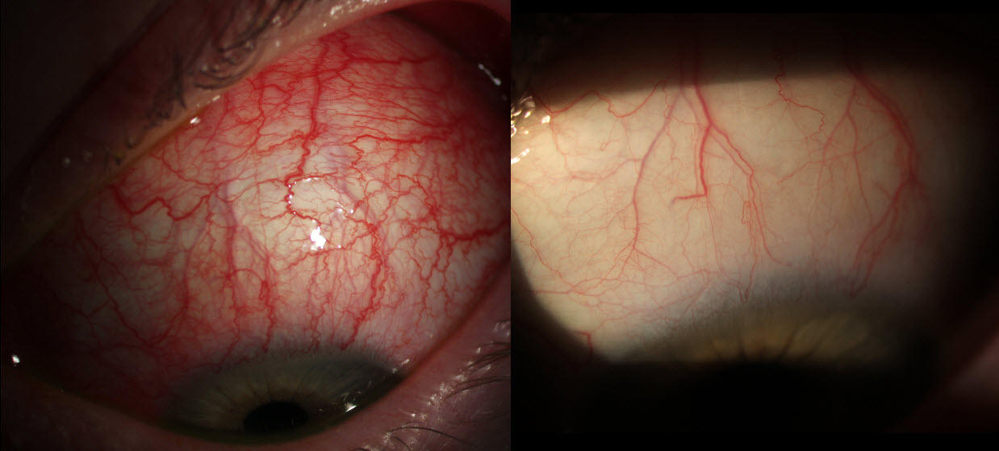

Conjunctivitis (commonly called 'pink-eye') occurs through inflammation of the thin transparent layer that lines the inner eyelids and white parts of the eye. This commonly occurs in children but can affect adults. Most cases of conjunctivitis will heal without intervention, but treatment from your optometrist can speed up the recovery and decrease the chance of permanent damage in severe cases. There are three different types of conjunctivitis: infectious, allergic and toxic conjunctivitis.

#### Infectious conjunctivitis

Infectious conjunctivitis may occur in only one eye and can be very contagious. When caused by bacteria, symptoms usually include a sticky, watery discharge and sticking together of the eyelids upon wakening. Infectious conjunctivitis may be treated with antibiotic eye drops and ointment to stop the infection and help the eye recover faster. 

This condition can also be caused by a virus in which symptoms include a red eye, a watery and clear discharge and a feeling that there is foreign matter in the eye. In this case, steroid drops may be prescribed by an optometrist to tone down the immune-reaction that causes the redness and discomfort.

CAPTION: A viral conjunctivitis before and after treatment 4 days later

To control the spread of infectious conjunctivitis it is important to keep your hands away from your eyes, wash your hands before applying eye medication, and refrain from sharing towels, face washers, cosmetics, pillows or eye drops with others.

#### Allergic conjunctivitis

Allergic conjunctivitis usually affects both eyes and is not contagious. This type of conjunctivitis occurs when airborne agents such as pollen, cosmetics, animals or fabric cause irritation. The body’s reaction can cause swelling of the conjunctiva, which is a thin glandular membrane. Some people also experience nasal allergy symptoms such as sneezing, sniffling and a stuffy nose. A common treatment is to use optometrist-recommended anti-histamine eye drops to decrease the adverse response of the ocular tissue to the allergen.

To manage allergic conjunctivitis, you should focus on prevention or avoidance of the allergens that trigger your symptoms. 

##### Tips to reduce your exposure to allergens that cause allergic conjunctivitis:

  * Stay indoors when the wind is blowing pollen
  * Wear spectacles or sunglasses outdoors
  * Avoid rubbing your eyes
  * Reduce dust mite exposure in your home
  * Wash hands straight after patting animals

CAPTION: Inflamed conjunctiva on the upper lid from allergic conjunctivitis

#### Toxic conjunctivitis

Toxic conjunctivitis may occur in one eye only and is not contagious. This condition occurs when the eye is exposed to irritants such as air pollution, noxious fumes and excessive chlorine in swimming pools. In the workplace or home, acids and cleaning chemicals can be the cause. The eye usually becomes irritated immediately after exposure. In the case of exposure to a chemical, the eye should be flushed, preferably with fresh water, for several minutes.

If you have some form of allergic or toxic conjunctivitis, it is important to consult your optometrist. If the cause of the problem is identified, you can then try to avoid it.
