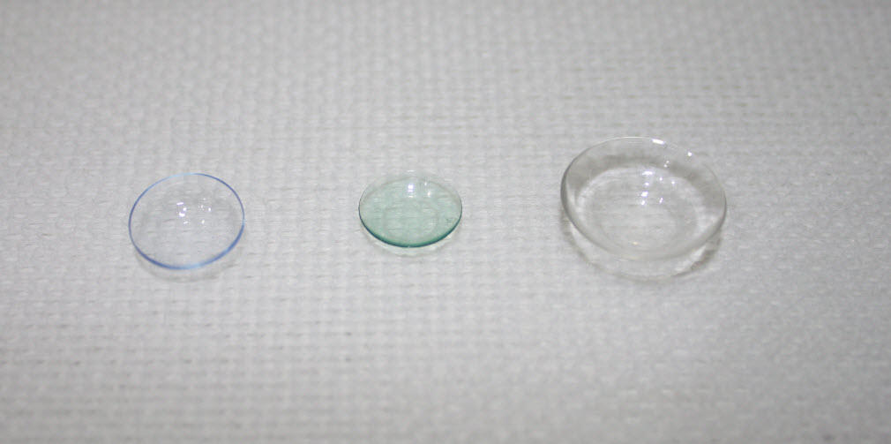
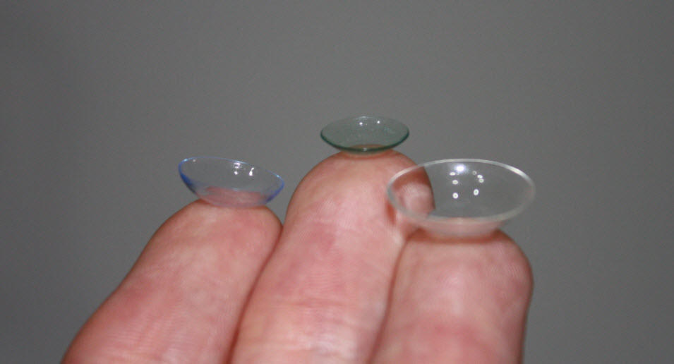

Contact lenses are an alternative option to spectacles for correcting vision and can offer clear vision for an array of eye conditions. At our Adelaide and Woodville branches, an optometrist can advise you on whether contact lenses are right for you. The following information will answer some of the questions you may have about contact lenses before your <a href="/what-we-do/eye-exam">appointment</a>.

<b>For more information on contact lenses, please see the links below:</b>

<h4>• <a href="/what-we-do/soft-contact-lenses">Soft Contact Lenses</a></h4>
<h4>• <a href="/what-we-do/gas-permeable-contact-lenses">Rigid Contact Lenses</a></h4>
<h4>• <a href="/what-we-do/scleral-contact-lenses">Scleral Contact Lenses</a></h4>
<h4>• <a href="/what-we-do/orthokeratology-corneal-reshaping">Orthokeratology Lenses</a></h4>
<h4>• <a href="/what-we-do/contact-lenses-for-presbyopia">Contact Lenses for Presbyopia</a></h4>
<h4>• <a href="/what-we-do/novelty-and-coloured-contact-lenses">Coloured Lenses</a></h4>

<!--[if IE]><iframe frameborder="0" type="text/html" src="https://2689-2347.captiv8online.com/animations/embed/one/d-t-o-o-t-t?player_width=100%&player_height=100%&site_company_language=34&autostart=false" width="100%" height="100%" style="position:absolute;top:0;left:0;width:100%;height:100%;"></iframe><![endif]--><!--[if !IE]> <--><object data="https://2689-2347.captiv8online.com/animations/embed/one/d-t-o-o-t-t?player_width=100%&player_height=100%&site_company_language=34&autostart=false" type="text/html" width="100%" height="100%" style="position:absolute;top:0;left:0;width:100%;height:100%;">  alt : <a href="https://2689-2347.captiv8online.com/animations/embed/one/d-t-o-o-t-t?player_width=100%&player_height=100%&site_company_language=34&autostart=false">Contact Lens Advantages</a></object><!--> <![endif]-->

 

At Innovative Eye Care, we offer a range of contact lenses that may suit your individual requirements, including [soft contact lenses](/what-we-do/soft-contact-lenses), [rigid gas permeable lenses](/what-we-do/gas-permeable-contact-lenses), [orthokeratology lenses](/what-we-do/orthokeratology-corneal-reshaping) and [scleral lenses](/what-we-do/scleral-contact-lenses).

CAPTION: A soft contact lens, a rigid orthokeratology lens and a rigid scleral contact lens

# Soft Disposable Lenses

These are the most common lenses used by patients today. They have an diameter of approximately 14mm and a large percentage of the lens is composed of water. Soft lenses are ideal for most sports, especially contact sports, as they are less likely to be lost. If they are damaged, new lenses are readily available in your multipack supply. They are generally more comfortable initially than gas permeable lenses, and it takes less time to adapt to wearing them, although they cannot correct some refractive conditions as effectively. Learn about proper care of soft disposable lenses [here](/patient-resources/care-of-soft-disposable-contact-lenses), or read some handy tips for long-term success [here](/patient-resources/tips-for-long-term-success-with-your-soft-disposable-contact-lenses). 

There are several different types of disposable (frequent replacement) lenses:

#### Daily Replacement Lenses (lenses that are new with each use and discarded after wear)

##### Advantages:

  * Lesser risk of infection – disposables have fewer deposit and inflammatory/infection problems than monthly and fortnightly lenses due to their shorter life span
  * Convenience – dailies do not require cleaning or storage with solutions and you can take spare lenses with you wherever you go, making them ideal for travel
  * Greater oxygen-supply – the newest daily lenses are made from silicone-hydrogel materials which increase oxygen flow to the eye and prevent dryness (these are slightly more expensive than standard dailies)
  * Cost-efficient for part-time wearers – if you only use your lenses occasionally, the cost is very similar to longer-term fortnightly or monthly lenses, and if a lens is lost or damaged the cost is negligible – just pop a new lens into your eye!

##### Disadvantages:

  * Limited range – currently, there is a restricted number of prescriptions that can be corrected with dailies; however, this range is increasing each year, and now a good proportion of people with astigmatism can be corrected with dailies.
  * Higher cost for full-time wearers – those who wear dailies every day may pay more than fortnightly/monthly lenses for more frequent replenishment of lens supply, although often patients find the increased convenience easily justifies the difference!

#### Monthly/Fortnightly Lenses (lenses that are worn daily but replaced monthly/fortnightly)

##### Advantages:

  * Wider range – these lenses are able to correct a greater array of prescriptions and higher degrees of astigmatism than daily disposables, and patients with presbyopia have the option of multifocal lenses (essentially progressive contact lenses)
  * Greater oxygen-supply – most monthly/fornightly disposable lenses are made from newer-generation silicone-hydrogel materials which allow increased oxygen flow to the eye and decreased dryness with wear
  * Convenience – suitable for intermittent wear with days away from your contact lenses if required (after consultation with your optometrist)
  * Colour – certain lenses can be available with a tint to accentuate your eye colour
  * Overnight wear – certain patients who would benefit from sleeping in their contact lenses without significantly compromising the health of their eyes have the option of lenses for overnight wear (after discussing this with their optometrist)
  * Cost-efficient – the cost per year for lenses and solutions may be slightly cheaper than daily lenses if you wear them most days

##### Disadvantages:

  * Risk of infection – longer-use lenses are more prone to deposits and pose a slightly higher chance of microbial infection and inflammatory reactions than daily disposable or rigid gas permeable lenses
  * Care and storage – cleaning of the lenses and storage in disinfection solution is required after each day of wear, and you will need to take the solution with you should you travel

# Rigid Gas Permeable Lenses (RGP) 

RGP lenses are made from a stiffer material and do not drape on the eyes like soft lenses do. Because of this, careful fitting is required. RGP lenses range in size from approximately 9-10mm to [scleral lenses](/what-we-do/scleral-contact-lenses) of approximately 16-17mm. Rigid lenses are generally reserved for extreme prescriptions or precision fits, such as keratoconus. [Orthokeratology](/what-we-do/orthokeratology-corneal-reshaping) lenses are a form of these hard lenses. Innovative Eye Care practitioners have had a keen interest in rigid lens fitting for a number of years and use a pioneering lens design software called EyeSpace to custom-design every hard lens used in the practice. Learn about proper care of RGP lenses [here](/patient-resources/care-of-gas-permeable-lenses). For more specific care instructions for scleral lenses, click [here](/patient-resources/care-of-scleral-lenses). 

##### Advantages:

  * Greater refractive correction – rigid lenses are able to correct larger degrees of [astigmatism](/what-we-do/astigmatism), extreme [myopia](/what-we-do/myopia) and [hyperopia](/what-we-do/hyperopia), and eyes with irregular corneal surfaces including those with [keratoconus](/what-we-do/keratoconus) or following [corneal grafts](/what-we-do/corneal-grafts) or injury
  * Clarity – vision quality is usually better than with soft lenses.
  * Low risk of infection –long-term health of the eye is usually better
  * Cost-effective – lenses tend to last longer (can be up to 1-2 years) and require less frequent replacement
  * Suitability – these lenses are great for non-contact sports

##### Disadvantages:

  * Comfort – rigid lenses are generally initially less comfortable and have a longer adaptation time than soft lenses (scleral lenses tend to be significantly easier to adapt to)
  * Convenience – cleaning the lenses and storage in disinfection solution is required after each day of wear, and you will need to take this solution with you if you travel
  * Irritation – problems can arise due to dust in smaller diameter lenses (this is not a problem with the larger scleral lenses as the edge of the lens seals against the eye, preventing debris from being trapped beneath)
  * Risk of loss – lenses can potentially become dislodged and misplaced due to their size and stability in the eye (this is not a problem with the larger scleral lenses which are very stable in the eye)

# Orthokeratology Lenses

[Orthokeratology](/what-we-do/orthokeratology-corneal-reshaping) (Ortho-K for short) is an exciting new treatment in vision correction now available to our patients, eliminating the need to wear contact lenses or spectacles to see clearly during the day. Ortho-K vision correction works by gently reshaping the centre of the cornea overnight with custom designed contact lenses. Technically speaking, these lenses use the hydrostatic forces of you own tear-film underneath the lens to redistribute the epithelial cells on the eye’s surface. Essentially this means that once the lenses are removed in the morning, you will have clear vision without any spectacles or contact lenses. Ortho-K can treat mild to moderate [myopia](/what-we-do/myopia) (short-sightedness), mild [hyperopia](/what-we-do/hyperopia) (long-sightedness), mild [astigmatism](/what-we-do/astigmatism) and even [presbyopia](/what-we-do/presbyopia). The Ortho-K vision correction process is completely reversible. It has recently been shown to reduce the progression of short-sightedness in younger patients. Learn about proper care of Ortho-K lenses [here](/patient-resources/care-of-orthokeratology-lenses). 

##### Advantages: 

  * Night-wear only – orthokeratology lenses offer clear vision during the day without wearing corrective lenses
  * Comfort – for patients who are bothered by day-time contact lens wear due to dry eyes or lifestyle (for example cyclists, water-polo players, surfers) find wearing lenses overnight to be much more tolerable
  * Myopia control – Ortho-K has been shown to reduce the progression of myopia in young patients.
  * Cost-efficient – lenses can last for up to 1-2 years if they are looked after and the eyes are stable, meaning costs are lower over time, and the process costs less overall than refractive surgery
  * Convenience – some patients with low prescriptions may only need to wear their lenses every second night!
  * Low risk – the chance of infection has shown to be very low, and for patients considering laser vision correction but concerned about the risk of surgery and potential for incomplete correction or post-surgical dry eyes, Ortho-K may be a better alternative
  * Reversible – the cornea would return to its original shape should you choose to discontinue with orthokeratology

##### Disadvantages:

  * Adjustment – as the treatment starts to take effect there can be days where vision is not perfect; however, this generally only causes issues over the first week and in most patients, approximately half of the change of prescription occurs after the first night!
  * Comfort – the lenses can take some getting used to, though as they are only worn during sleep they are generally well tolerated
  * Temporary distortion – some patients find that the vision in the evenings can result in halos forming around lights as the pupil enlarges in the dark, but this generally improves with time and if the effect is highly bothersome your optometrist can prescribe drops to improve this when required
  * Replacement cost – if lenses are lost or broken, replacements can be costly (your optometrist will recommend you have a spare pair of lenses which can be purchased at 50% of the normal cost within 18 months)

CAPTION: A soft lens, an orthokeratology lens, and a scleral lens

# Cost

The costs of being fitted into contact lenses varies depending on the type of lens used and the complexity of the fitting process. Careful fitting of all contact lenses is required to offer the clearest and most comfortable vision without compromising the health of the eye. 

In most cases patients with high prescriptions, different prescriptions between the eyes or irregular prescriptions (like keratoconus) may have the majority of the costs of their contact lens fitting consultations covered by Medicare. In patients that do not meet this criteria there is a fitting charge of $150 for standard cases and refits, and $180 for complex cases. This includes the appointments to teach you how to use the lenses, aftercare appointments to ensure the lenses are fitting well over time, and any trial lens required to get the fit correct. 

In most contact lens fits we use technology such as [corneal topography](/what-we-do/corneal-topography) and [OCT scans](/what-we-do/oct) to perfect the fit of our lenses. Medicare does not provide benefits for these additional tests and the use of this equipment will carry a small additional charge (children and pension/health care card holders get 50% off).

Daily replacement soft lenses tend to be priced at just over $100 for a 3 month supply per eye. A monthly replacement soft lens is about 2/3rd of this cost for the same 3 month period per eye, but does require cleaning solutions, is less convenient and carries a higher risk of infection than a daily replacement lens. More complex soft lens types like toric lenses to correct astigmatism, or [multifocal lenses for patients with presbyopia](/what-we-do/contact-lenses-for-presbyopia) will be more expensive than a standard lens.

Rigid lenses (including orthokeratology lenses) cost $350-$450 each depending on the complexity of the design. Scleral lenses are more difficult to manufacure and cost $600 each. Don't forget these lenses last 1-2 years on average. Back-up lenses of identical parameters can be ordered at half price within 12 months of the original order.

Please feel free to [contact our team](/contact) for more details about the costs of different contact lenses.
