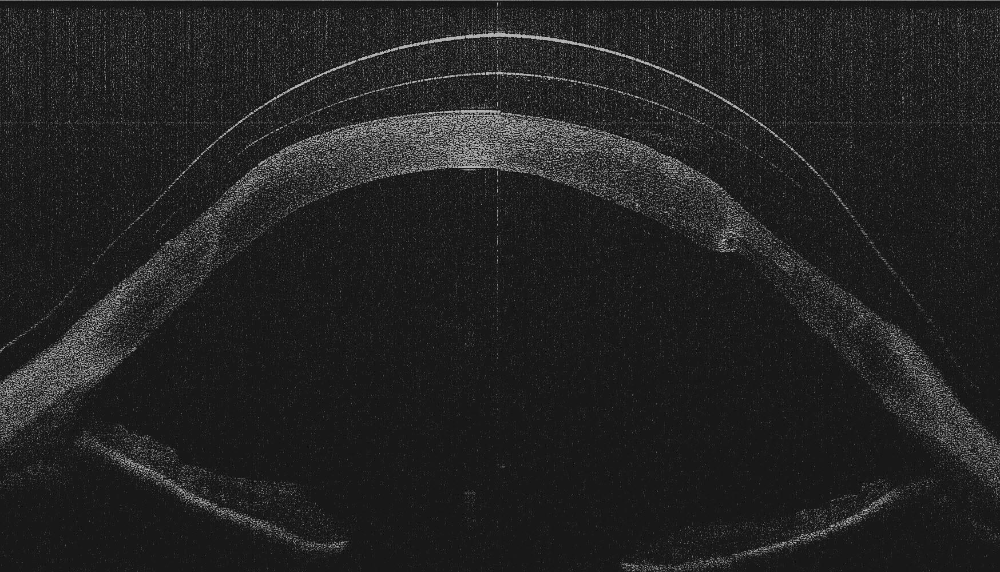
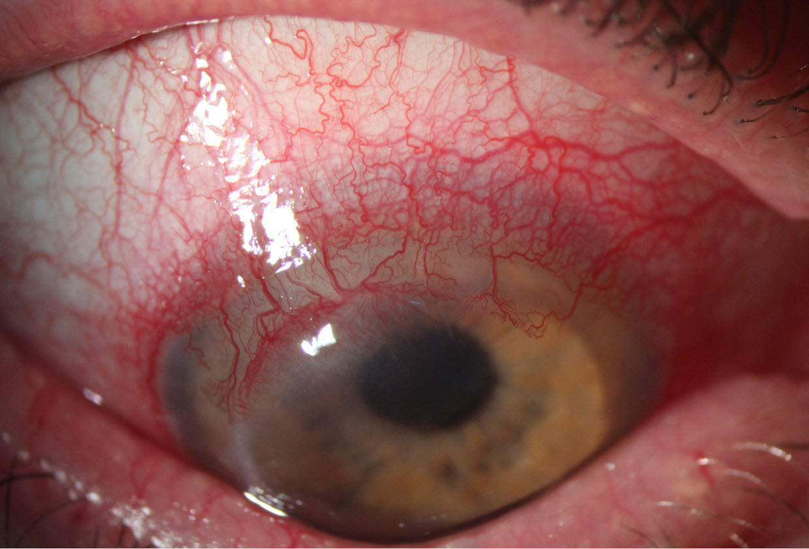

Corneal grafts are required when the cornea is too compromised due to scarring or disfunction to offer good vision. After the cornea from a donor is implanted into the eye, careful monitoring is required by your eye specialist to ensure its viability in the future. Often glasses or specialised contact lenses such as <a href="/what-we-do/gas-permeable-contact-lenses">RGPs</a> or  <a href="/what-we-do/scleral-contact-lenses">sclerals</a> are required to give good vision in an eye with a graft, due to the frequently irregular front surface.

 

At Innovative Eye Care we are often asked by ophthalmologists and other optometrists to help patients who have had corneal grafts achieve good vision. Sometime we can manage this with spectacles, but more often we have the best success with large diameter [scleral lenses](/what-we-do/scleral-contact-lenses), for a variety of reasons.

CAPTION: A new corneal graft with sutures still in place, showing the irregular corneal surface.

The donor cornea is often irregular in shape and this makes it very difficult to fit a standard RGP or soft contact lens. A scleral lens will vault over a grafted eye without touching the surface. Not only is this good for vision but also for the physiology of the tissue.

CAPTION: An OCT scan of a scleral vaulting over the donor corneal tissue

This is especially important due to the risk of graft-rejection. If the donor tissue is chronically inflamed or traumatised, the body may identify the new corneal tissue as foreign, causing scarring and loss of function. A poorly fitting lens resting on the eye makes this more likely to occur. This can be devastating for the patient (not to mention uncomfortable) as it may mean a second graft is required. Light sensitivity is a very important symptom to watch out for if you have a sore corneal graft as this may indicate impending rejection. You should visit your optometrist promptly if this occurs.

CAPTION: A corneal graft showing worrying early signs of a rejection. This patient's eye was saved with a timely visit to our practice.
