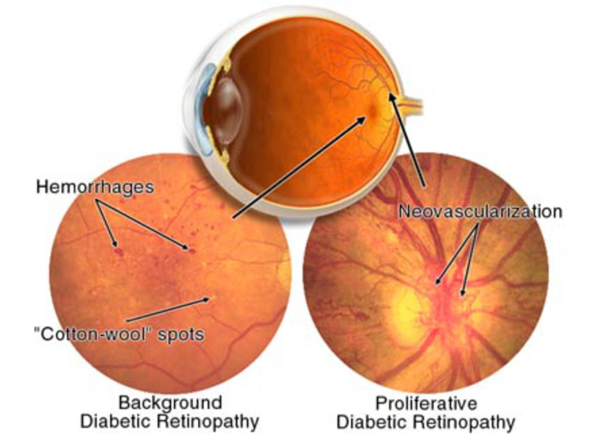
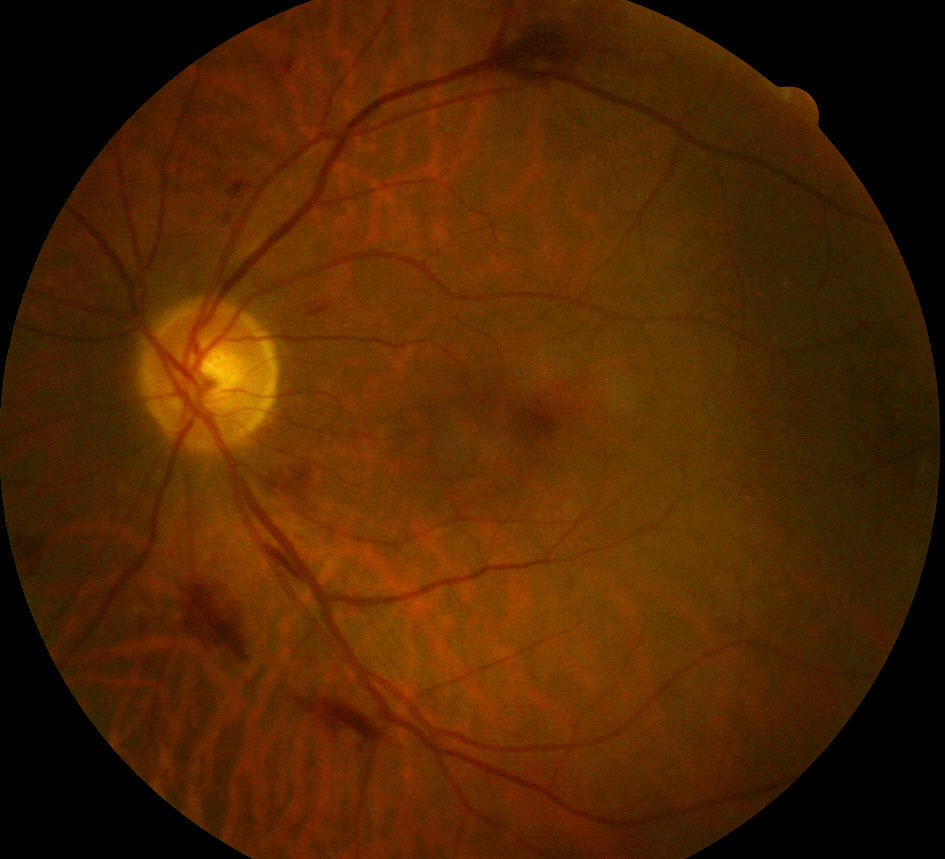
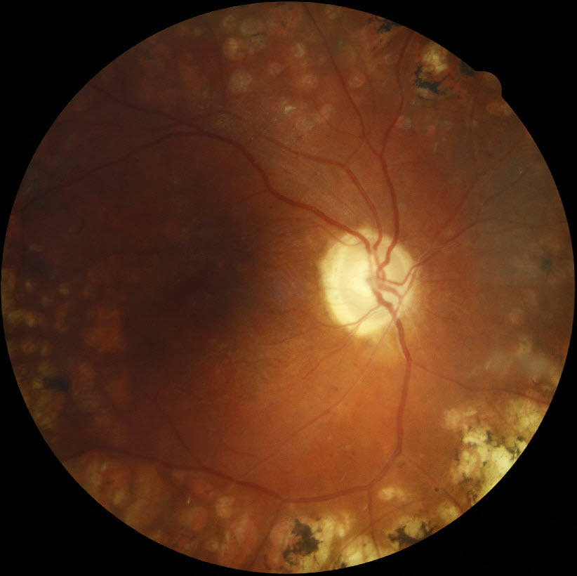
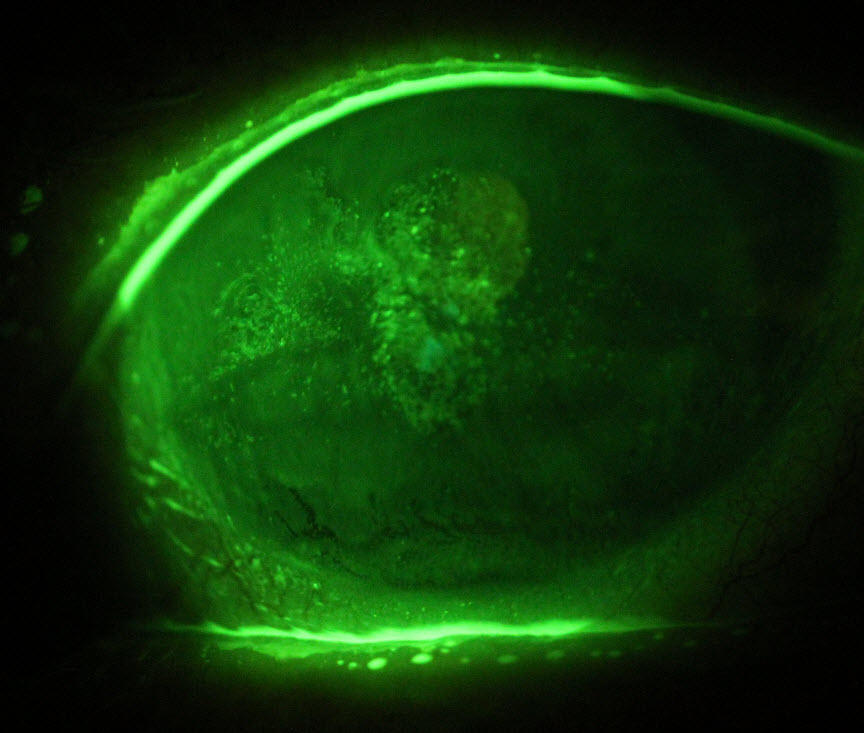
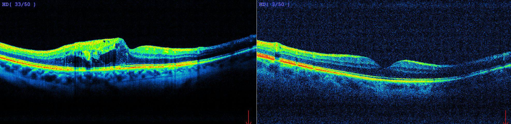

About 7% of the Australian population over 25 years of age have diabetes, increasing to about 25% over 75 years of age. More than 70% of diabetics will develop some changes in their eyes within 15 years of diagnosis. These changes can be potentially blinding. All diabetics should ensure they visit their optometrist at least every two years for a thorough <a href="/what-we-do/eye-exam">examination</a>.

<!--[if IE]><iframe frameborder="0" type="text/html" src="https://2689-2347.captiv8online.com/animations/embed/one/d-t-t-op-t?player_width=100%&player_height=100%&site_company_language=34&autostart=false" width="100%" height="100%" style="position:absolute;top:0;left:0;width:100%;height:100%;"></iframe><![endif]--><!--[if !IE]> <--><object data="https://2689-2347.captiv8online.com/animations/embed/one/d-t-t-op-t?player_width=100%&player_height=100%&site_company_language=34&autostart=false" type="text/html" width="100%" height="100%" style="position:absolute;top:0;left:0;width:100%;height:100%;">  alt : <a href="https://2689-2347.captiv8online.com/animations/embed/one/d-t-t-op-t?player_width=100%&player_height=100%&site_company_language=34&autostart=false">Diabetes: Overview</a></object><!--> <![endif]-->

 

Vision changes are one of the main ways that diabetes causes disease in the body and optometrists play a fundamental role in diagnosing the changes to the eyes in diabetics in the early stages when they respond best to treatment. Once diagnosed it is important that all diabetics have the health of their eyes comprehensively examined at least every 2 years. Diabetes can affect all parts of the eyes – the cornea, the lens and the retina. Many diabetic problems can also occur without any obvious visual symptoms. The fact that the health of the eyes also directly relates to the health of the rest of the body highlights how important monitoring a diabetic’s ocular health is.

# Diabetic retinopathy

After diabetes has been present for some years, changes may occur at the back of the eye in the retina, known as diabetic retinopathy. Your optometrist may use an instrument called an ophthalmoscope and [advanced imaging technology](/what-we-do/oct) that will clearly show these changes. There are two main types of this condition: non-proliferative (sometimes called background) retinopathy and proliferative retinopathy. The risk of developing retinopathy increases with the length of time you have had diabetes. The risk is also increased when blood glucose levels are not well controlled over time.

CAPTION: Signs of diabetic retinopathy in the retina

#### Non-proliferative retinopathy

Increased glucose concentration in the blood affects the circulatory system in diabetics. Initially this causes the small vessels in the retina to become weak. This can lead to small bulges in the vessels called microaneurysms, or the vessels can leak, causing haemorrhages and exudates (collections of lipid residues). This is termed non-proliferative retinopathy. These leaks can cause swelling of the retina, and if this occurs in the macula (the central part of the retina responsible for sharp detail), it can decrease a patient’s vision. Occasionally a swelling of the retina may cause hazy vision or straight lines to appear bent. Your optometrist may instruct you in a simple procedure to carry out at home so that you can test your eyes for this condition. If vision is affected in this way your optometrist can confirm its cause and will refer you for appropriate treatment. Improvements in the patient’s diabetic control and co-morbidities such as blood pressure and cholesterol can help resolve these changes. Sometimes a focal laser treatment is needed to close off very leaky vessels.

CAPTION: Several moderate-sized haemorrhages in the retina of someone with moderate non-proliferative diabetic retinopathy

#### Proliferative retinopathy

This condition is more serious and requires early treatment to prevent serious vision loss. Your optometrist can recognise signs that this condition might develop, or detect it in its early stages. Once proliferative retinopathy has been diagnosed, your optometrist will refer you to an eye surgeon for further appraisal and probable laser treatment. Treatment of this condition has a better chance of success if it is applied very early. 

Proliferative changes occur if areas of the retina become starved of oxygen (ischaemic). This leads to fragile new blood vessels (neovascularisation) growing to resupply the ischaemic tissue. Unfortunately these vessels leak easily and can bleed, causing sudden vision loss. If these new vessels scar and constrict they can pull on the retina and lead to a retinal detachment. Patients may need pan-retinal photo-coagulation if their retina is very ischaemic. This is a procedure where laser burns are used to kill off some of the less-important peripheral retina. This decreases the oxygen demand of the central retina and helps prevents further changes.

CAPTION: A retina that has undergone peripheral laser photocoagulation for proliferative diabetic retinopathy

# Common signs & symptoms of diabetic change in the eye

#### Changeable focusing ability

Diabetes sometimes causes the focusing ability of the eye to weaken or fluctuate from day to day due to swelling of the crystalline lens inside the eye. This characteristic has often led to optometrists diagnosing diabetes in their patients. The problem eases when blood glucose levels are well controlled. Diabetes can also cause more dangerous changes in the eyes, primarily through its effects on the blood vessels in the retina.

#### Double vision

This is a distressing but rare complication of diabetes. The condition is usually temporary but it may last for a few months. An optometrist can help to treat it while it has effect. Diabetes is not the only cause of double vision so it is best to have this checked by your optometrist if it occurs.

#### Dry eye

Diabetics experience higher rates of ocular surface disease such as dry eye. Research shows that most cases of dry eye associated with diabetes are caused by insufficient production of tears due to "autonomic neuropathy" affecting the nerves that control the lacrimal gland. That is, the same process leading to diabetic peripheral neuropathy that causes symptoms like tingling or burning in the hands and feet, can also affect the nerves that normally sense dryness and produce moisture to keep the eyes well lubricated. See our dry eye page for more information _[here](/what-we-do/dry-eyes)_.

CAPTION: Dry eye seen in a diabetic with the affected areas seen as a lighter green when viewed with fluorescein

# Managing diabetic retinopathy

Controlling blood glucose over time significantly reduces the risk of developing retinopathy, but does not eliminate it. The best management is to have regular eye examinations so that changes can be detected and treated early. It is advisable for all people with diabetes to have annual eye examinations. People who have been diagnosed as having retinopathy should have eye examinations more frequently than once a year. In addition, regular visits to your general practitioner or endocrinologist may help to control blood glucose levels.

<!--[if IE]><iframe frameborder="0" type="text/html" src="https://2689-2347.captiv8online.com/animations/embed/one/diab-treat?player_width=100%&player_height=100%&site_company_language=34&autostart=false" width="100%" height="100%" style="position:absolute;top:0;left:0;width:100%;height:100%;"></iframe><![endif]--><!--[if !IE]> <--><object data="https://2689-2347.captiv8online.com/animations/embed/one/diab-treat?player_width=100%&player_height=100%&site_company_language=34&autostart=false" type="text/html" width="100%" height="100%" style="position:absolute;top:0;left:0;width:100%;height:100%;">  alt : <a href="https://2689-2347.captiv8online.com/animations/embed/one/diab-treat?player_width=100%&player_height=100%&site_company_language=34&autostart=false">Diabetes: Treatments</a></object><!--> <![endif]-->

 

# Diabetic care at Innovative Eye Care 

The role of optometry in diabetic management in retinal health is that of close monitoring and communication with other health professionals involved in the patient’s diabetic care. If we detect the development of diabetic retinopathy we can instigate changes to the diabetic control with the help of the patient's general practitioner or endocrinologist. If needed we can also refer to ophthalmology for a surgical opinion. 

At Innovative Eye Care we recommend a dilated eye exam to best assess the health of the retina. Dilating the pupils enables us to get a much clearer view of the back of the eye. Dilating drops last for 4-6 hours and may cause glare and blurry vision. Because of this we recommend not driving following a diabetic retinal examination. 

We use a range of equipment on the forefront of diagnostics during a [comprehensive diabetic health exam](/what-we-do/eye-exam). This includes [retinal photography](/what-we-do/retinal-photography) to record and monitor subtle signs in the retina, examination using bio-microscopy to stereoscopically assess both the central and peripheral retina, and [optical coherence tomography](/what-we-do/oct), a technology that can scan the retinal layers to look for swelling and other damage. Some of the additional tests necessary for a comprehensive diabetic retinal examination fall outside of what is covered by Medicare. Because of this there may be additional charges to cover the cost of the equipment and consumables.

CAPTION: OCT scans showing swelling at the macula of a diabetic (left) compared to a normal macula in the patients other eye (right)
