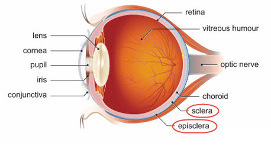

Often misdiagnosed as conjunctivitis, both episcleritis and scleritis are inflammatory disorders of the white coating of the eye that cause redness and pain. Any redness of the eye associated with discomfort should be seen by your optometrist so that the correct diagnosis made and the most appropriate treatment commenced. 

# Episcleritis

Episcleritis is generally milder than scleritis and does not have the same potential to cause vision loss..1 This condition involves inflammation of the tissue between the surface of the eye and the deeper structural tissue (sclera). It can sometimes be isolated to only a certain sector of the eye. Instillation of a blood-vessel constricting agent like phenylephrine will shrink only the episcleral vessels and thus can differentiate episcleritis from the more serious scleritis.2 Most cases occur without cause (idiopathic) but up to 30% of cases may be related to a systemic condition such as inflammatory bowel disease or connective tissue disease.1,3 Most episcleritis is self-limiting but often your optometrist will prescribe anti-inflammatory eye drops to speed up the recovery.3

# Scleritis

Scleritis is a more severe inflammatory condition affecting the deeper collagen support of the eye – the sclera. Scleritis is often characterised by a deep pain, which can vary through mild to intense enough to wake you at night.1 Diagnosis is helped with examination under natural light - the deeper inflamed vessels have a characteristic purple hue.2 Fortunately the condition is rare, but like episcleritis, it can often be associated with underlying autoimmune disease such as rheumatoid arthritis, HLA-B27–associated inflammation, Wegener's granulomatosis, polychondritis, systemic lupus erythmatosus, inflammatory bowel disease and viral infection.1 The severity and treatment of scleritis varies depending of the depth of tissue affected, with some forms of scleritis carrying the risk of permanent vision loss.

CAPTION: The parts of the eye affected in scleritis and episcleritis. Courtesy of BUPA (http://www.bupa.co.uk/health-information/directory/s/scleritis)

<b>References</b>

1. Sainz de La Maza M, Molina N, Gonzalez-Gonzalez LA, Doctor PP, Tauber J, Foster CS. Clinical Characteristics of a Large Cohort of Patients with Scleritis and Episcleritis. Ophthalmology, January 2012, Vol.119(1), pp.43-50

2. Watson PG, Hayreh SS. Scleritis and episcleritis. Br J Ophthalmology, 60 (1976), pp. 163-191

3. Jabs DA, Mudun A, Dunn JP, Marsh MJ. Episcleritis and scleritis: clinical features and treatment results. Am J Ophthalmology, 2000, Vol.130(4), pp.469-476
