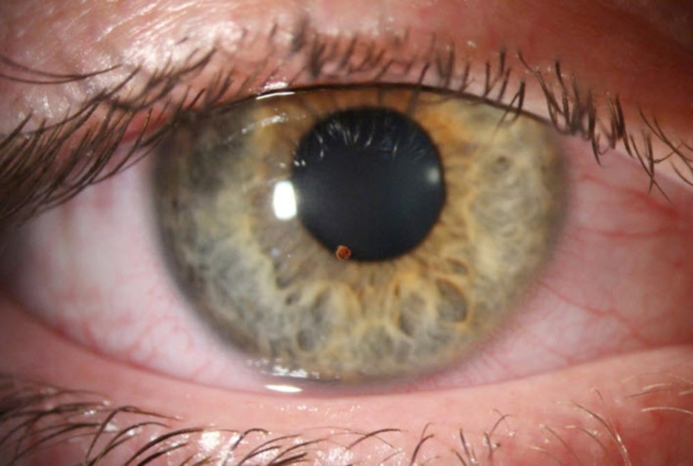
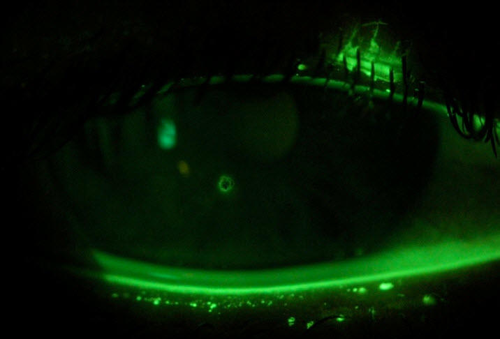
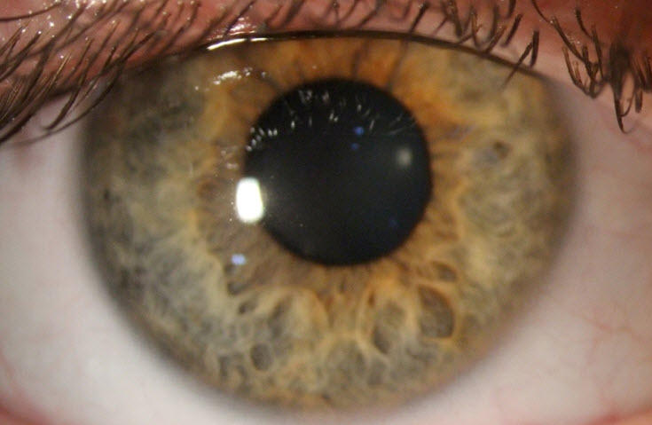
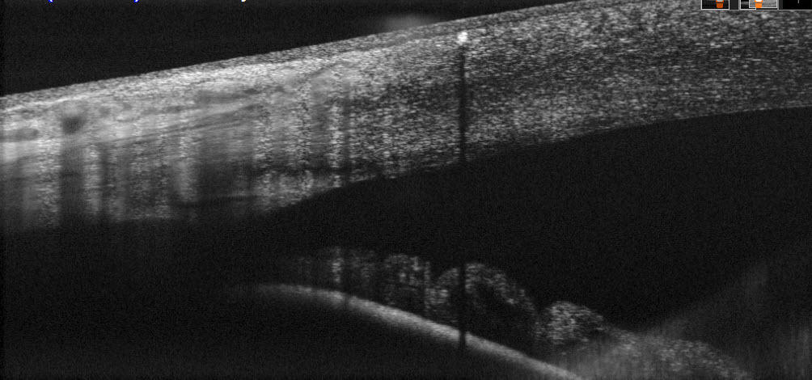
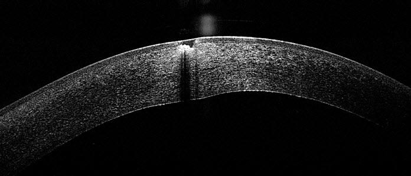
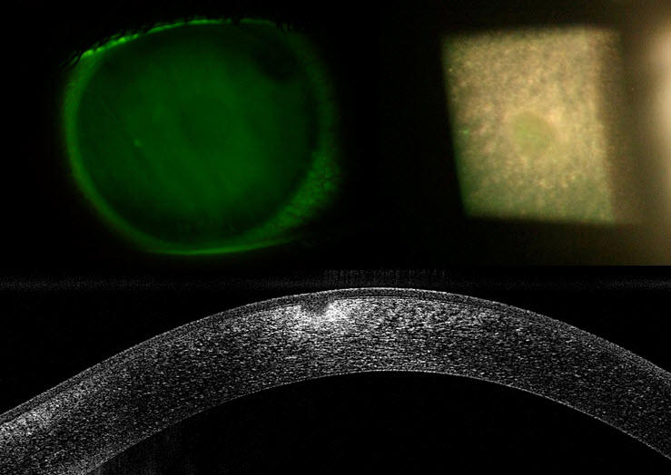

Foreign material can become lodged on the cornea or conjunctiva of the eye. This can occur through working with grinding tools, gardening or simply chance when out and about. Generally this will lead to grittiness and irritation, tearing, redness, and light sensitivity if severe. Make sure you use safety glasses (available at Innovative Eye Care) in any situation where your eyes may be at risk of particles flying into the eye.

Foreign bodies on the cornea or conjunctiva can be removed by your optometrist with local anesthetic and specialised removal tools. This should be done promptly to avoid long-term complications. Some foreign bodies will leave a scar; this only affects vision if it is lodged right over the central part of the cornea that you look through. After the removal of corneal foreign bodies, your optometrist will often need to smooth the area out, which is done with a small grinding burr. This helps the area to heal correctly and decreases the change of conditions like recurrent-erosion syndrome in the future. A burr is sometimes needed to remove any rust that a metallic foreign body produces in the eye.

CAPTION: A metal foreign body in the eye after a grinding injury.

CAPTION: The same foreign body when viewed with sodium fluorescein dye in the eye.

CAPTION: The same eye following successful removal of the foreign body.

Following a foreign body removal, your optometrist will generally write a prescription for prophylactic antibiotic drops for you to use in the affected eye four times a day for the next few days. This prevents an opportunistic infection from occurring as your eye heals. It is not usual for the eye to be sore for a day or two as the surface cells heal. If this is bothersome, using oral pain-relief medications as you would for a headache is appropriate.

CAPTION: OCT of a very small organic foreign body embedded at the edge of this patient’s cornea. This has been in the eye for at least several days as the cornea’s surface cells have grown over it.

CAPTION: A metal foreign body in the eye after a grinding injury. Note the slight swelling (thickening) of the cornea.

CAPTION: 1 week after removal, note the slight circular scar.
