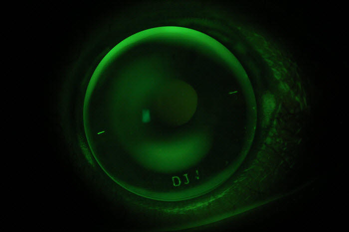

Rigid gas permeable (RGP) contact lenses are a type of lens made with stiff silicone polymers that still allow oxygen to pass through to the cornea, giving them their name. Our Adelaide and Woodville practices are equipped with exciting new <a href="/what-we-do/anterior-imaging">technology</a> that allows our optometrists to design custom RGP lenses for our patients that can improve vision for wearers with a range of eye conditions.

If you would like to know if you're a candidate for rigid lenses, make an <a href="/what-we-do/eye-exam">appointment</a> with one of our practitioners.

Conditions such as [myopia](/what-we-do/myopia), [astigmatism](/what-we-do/astigmatism), aphakia, [keratoconus](/what-we-do/keratoconus), and irregular corneas benefit from RGP lenses. This is because they hold their shape and provide an even front optical surface for the eye. RGPs are more durable and last longer (often at least a year) than soft contact lenses. They come in a variety of types to treat individual eye conditions. At Innovative Eye Care we use a customised lens design program called EyeSpace to accurately design the fit and power of your lens for your eye.

The main drawback to rigid lenses is that they may take a little longer to adapt to using as they are generally a little less comfortable than wearing a soft contact lens. For advice on rigid contact lenses and solutions, please consult our team. For insertion, removal, cleaning and maintenance regimes, see our page on [care of gas permeable contact lenses](/patient-resources/U3l2xwEAADQADBFJ/care-of-gas-permeable-lenses).

CAPTION: A rigid lens seen with sodium fluorescein on an eye with keratoconus.

Certain types of rigid lenses can be worn overnight, changing the shape of the cornea and eliminating the need to wear spectacles or contact lenses during the day (see our [orthokeratology](/what-we-do/orthokeratology-corneal-reshaping) page).
