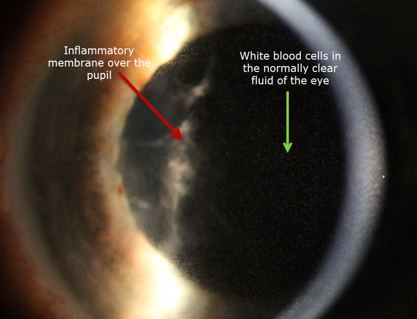

Iritis is a condition which involves inflammation of the iris within the eye. This is the most common type of anterior uveitis – a term covering inflammation of the deep pigmented tissues at the front of the eye. Iritis may occur in one or both eyes; however, it is more common for just one eye to be affected at a time. The eye is often red, painful and light-sensitive with this condition. Iritis is potentially sight-threatening and needs prompt treatment from your therapeutically trained optometrist.

#### What is iritis?

The iris is the coloured part of the eye that surrounds the pupil. It is comprised of muscular fibers. The iris controls the amount of light entering the eye by making the pupil smaller in bright light and larger in dim light. When inflammation of the iris develops, it is termed iritis. This is most prevalent in young and middle-aged people. 

#### What are the symptoms of iritis?

Symptoms of iritis include eye pain, redness of the eye, increased sensitivity to light, blurry or cloudy vision. Less commonly, the pupil can become smaller or irregularly-shaped. Patients become light sensitive because the inflamed iris moves in response to light which causes pain. A good analogy would be tugging on a broken arm! Mucous discharge is not a symptom of iritis; this differs from many cases of conjunctivitis.

#### What causes iritis?

There are many different causes of iritis and it is associated with a number of other diseases. Iritis may develop in association with autoimmune or inflammatory diseases such as sarcoidosis, lupus, scleroderma, rheumatoid arthritis, Behcet's disease, anklylosing spondylitis, Reiter's disease, Crohn's disease, and ulcerative colitis. These conditions are often associated with someone who is HLA-B27 positive, which is a type of antigen in our DNA. Although less frequent, infectious causes may include Lyme disease, tuberculosis, toxoplasmosis, syphilis, herpes simplex and herpes zoster viruses. Additional causes of iritis are exposure to toxins, trauma, or ocular surgery. In many cases, however, no specific cause for uveitis is found; this is known as idiopathic uveitis.

#### How is iritis diagnosed?

A slit lamp microscope is used to look for the presence of white bloodcells (leukocytes) or hazy protein deposits inside the eye. These are a sign of inflammation. Your eye specialist may find that intraocular eye pressure is reduced. The iris is an extension of the part of the eye that produces intraocular fluid; hence, when inflamed, production of this fluid can be affected. In contrast, some forms of iritis actually cause intraocular pressure to increase when material blocks the drainage of fluid from within the eye. 

CAPTION: A severe iritis showing some of the characteristic signs seen on examination.

# How is iritis treated?

Treatment is aimed at decreasing inflammation. Anti-inflammatory eye drops (corticosteroids) are the most common form of treatment. Dilating drops may also be instilled to prevent the iris from adhering to the crystalline lens and to reduce patient discomfort. Iritis usually responds well to treatment; however, it may recur, especially if associated with an underlying disease. In severe cases, permanent visual loss can result from iritis. When symptoms occur, a prompt examination by your eye specialist is vital.
