

Keratoconus is an eye disease that can cause distorted, blurry vision that often requires <a href="/what-we-do/contact-lenses">more complex contact lens solutions</a>. It is a non-inflammatory, degenerative eye condition caused by the thinning of the cornea. This results in the front surface of the eye protruding into a 'cone' shape. At our Adelaide and Woodville branches, our optometrists have an interest in keratoconus, and one of our optometrists, Lachlan Hoy, has written a text book chapter on keratoconus that will be distributed globally.

Keratoconus management is often reliant on early detection. If you are interested in making an <a href="/what-we-do/eye-exam">appointment</a>, please contact us for more information.

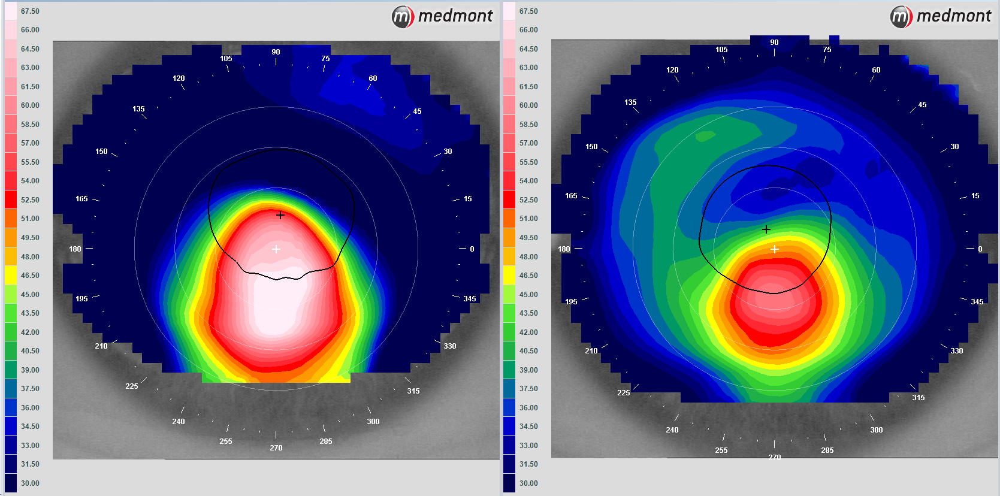

CAPTION: A [corneal topography](/what-we-do/corneal-topography) of a right and left eye in a patient with keratoconus. Note the size and position of the "cone" (displayed by the red colour).

Keratoconus has been researched thoroughly and the findings of the past 20 years have enormously increased our understanding of the nature of the condition which allows us to better diagnose, treat and manage individual cases. The condition involves progressive thinning of the cornea (the front surface of the eye), causing the surface to protrude forward, giving the disease its name ("<i>keras</i> "meaning cornea, and "<i>konos</i>" meaning cone). With increased severity, the amount of protrusion increases and so too does the irregularity of the otherwise smooth and regular cornea.1 Due to the progressive nature of keratoconus, early detection is important to ensure the appropriate management is undertaken. 2

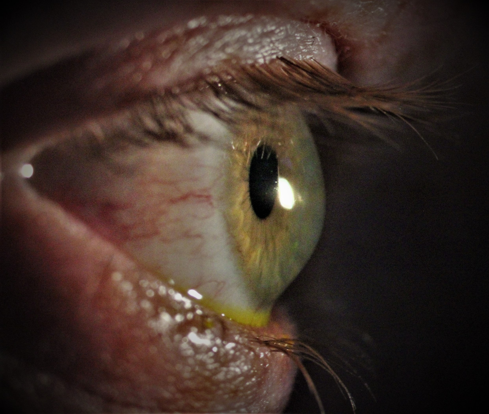

CAPTION: A side profile of an eye with keratoconus. Note the protrusion, and bulging of the inferior cornea. *Image courtesey of [Lachlan Hoy](/who-we-are/lachlan-hoy) using the digital biomicroscopy*

<!--[if IE]><iframe frameborder="0" type="text/html" src="https://2689-2347.captiv8online.com/animations/embed/one/t-to-o-u?player_width=100%&player_height=100%&site_company_language=34&autostart=false" width="100%" height="100%" style="position:absolute;top:0;left:0;width:100%;height:100%;"></iframe><![endif]--><!--[if !IE]> <--><object data="https://2689-2347.captiv8online.com/animations/embed/one/t-to-o-u?player_width=100%&player_height=100%&site_company_language=34&autostart=false" type="text/html" width="100%" height="100%" style="position:absolute;top:0;left:0;width:100%;height:100%;">  alt : <a href="https://2689-2347.captiv8online.com/animations/embed/one/t-to-o-u?player_width=100%&player_height=100%&site_company_language=34&autostart=false">Keratoconus: What is it?</a></object><!--> <![endif]-->

 

Early in the course of this disorder, resulting visual changes can present like any other form of refractive error including [short-sightedness](/what-we-do/myopia), [long-sightedness](/what-we-do/hyperopia) or [astigmatism](/what-we-do/astigmatism).3 Very early keratoconus may be corrected with spectacles or soft contact lenses. As the disease progresses the cornea becomes more distorted, leading to poor vision even with these corrections.4 Corneal [rigid gas-permeable (RGP) lenses](/what-we-do/gas-permeable-contact-lenses) or [scleral lenses](/what-we-do/scleral-contact-lenses) are useful at this stage as the strong polymer the lenses are made from does not drape over the irregular corneal shape but instead holds its form, thus creating a new and regular front surface of the eye.5 This will provide the best vision for someone with keratoconus.

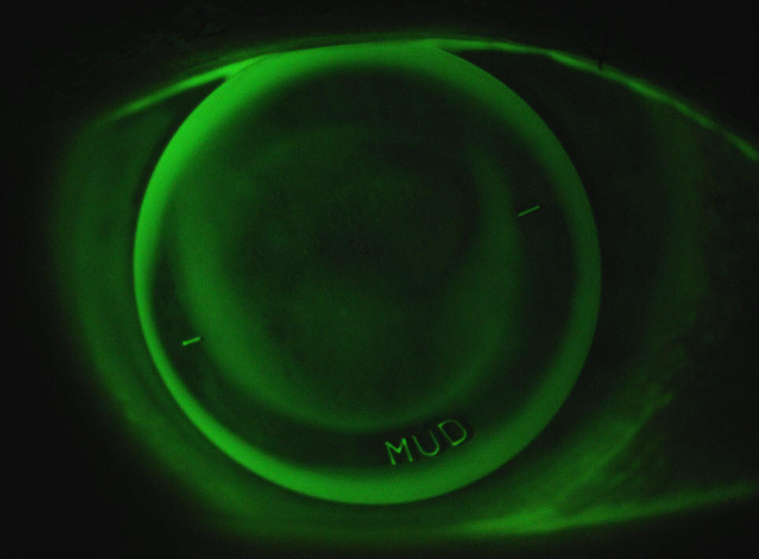

CAPTION: A well fitted rigid contact lens on a keratoconic eye. In order to fit the patient's cornea better there is a steeper part of the lens at 6 o'clock shown by the 'MUD' inscription.

# How common is keratoconus?

The older, most frequently cited conjectured prevalence of keratoconus was estimated at around 0.05% around the general population.6 However, more recently this has been challenged with incidence as high as 0.26% in some populations.7 In Australia, keratoconus affects about 1 in 2000 people. It generally presents during pre-teenage years and progresses through teen years to your forties, although the age at which it worsens varies from person to person.8 It is common for each eye to have a differing degree of severity.9 Family history is considered a factor, and according to one study the probability of being diagnosed with keratoconus if an immediate family member has the disease is 14%.10 Most studies indicate that no gender is more predisposed to the condition, but it is more prominent among patients with a personal history of allergy or eye rubbing. Often your optometrist will recommend certain anti-allergy eye drops to decrease symptoms of itchiness which cause keratoconics to rub their eyes and worsen their condition.11

# How is keratoconus diagnosed?

At Innovative Eye Care we use the latest technologies to diagnose the condition at its earliest stages and to monitor any changes in progression. It is difficult to make an accurate diagnosis without the use of such equipment, and it also allows our team to manage sub-clinical cases.12 There are 3 different types of cones present in keratoconus; central nipple cone, low oval cone and globus cone, with the latter being the least common.13

Unfortunately, being a multifactorial disease, onset and progression is extremely variable between different people, and even between different eyes of the same person. Keratoconus is very unpredictable and can progress rapidly over a short period of time, before stabilising for months or years, then progressing again.14

#### Slit lamp biomicroscopy

Microscopy of the front surface of the eye conveys the shape and thickness of the corneal surface.

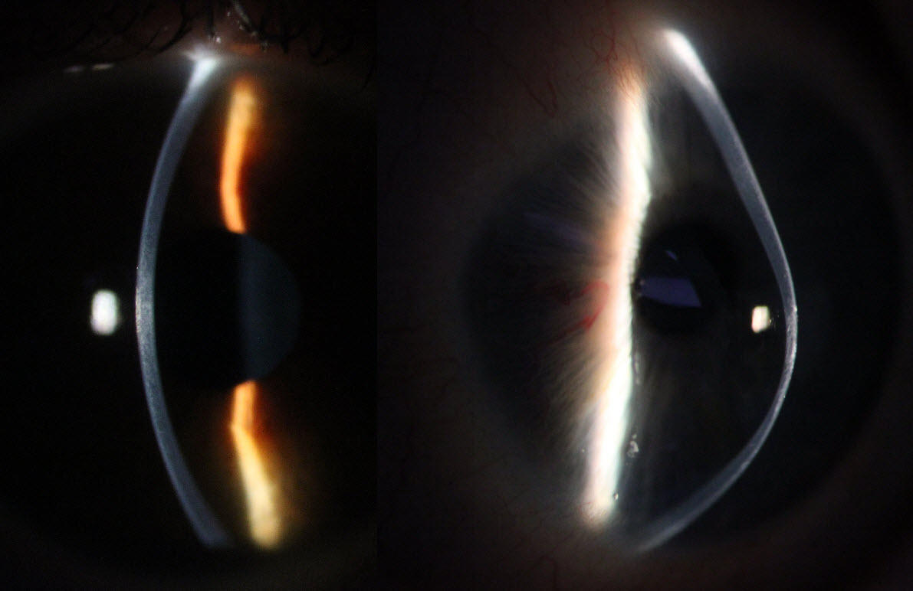

CAPTION: Slit lamp biomicroscopy of normal cornea and keratoconic cornea

The above images show a normal, regular cornea on the left and a keratoconic cornea on the right. Note the forward protrusion of the cornea in the keratoconic eye, with a notable thinning of the cornea compared to the normal eye.

As well as corneal shape and thickness, there are a number of other findings visible under microscopy. These include the presence of prominent corneal nerves, Fleischer's iron ring and Vogt’s striae (corneal stress lines).15

#### Corneal topographical mapping

Corneal topography is a non-invasive way to measure the contours and shape of the cornea. It is the 'gold standard' in diagnosing and assessing keratoconus.16 Topographers work by shining concentric rings of light on the cornea and assessing what is reflected back. If the cornea is even and regular, the rings are reflected back evenly as well.

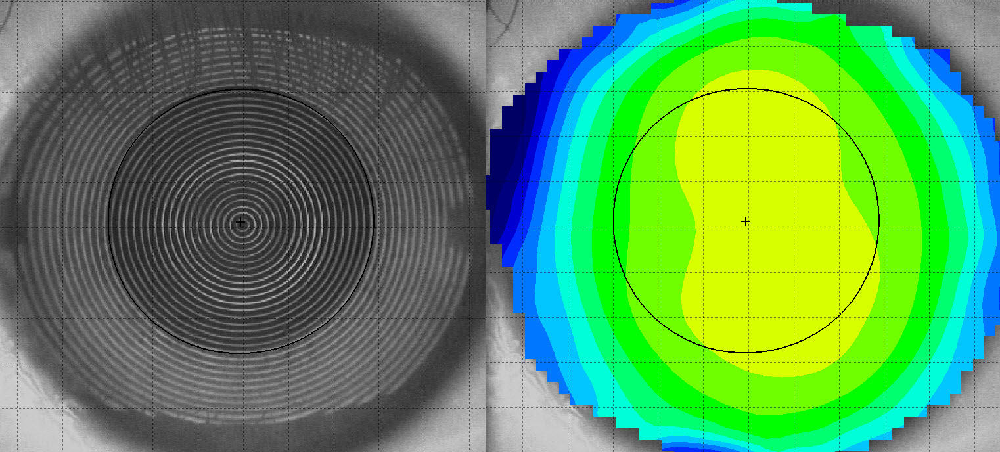

CAPTION: Corneal topography of normal cornea

The above images are the topographical results of a relatively normal cornea. Note the regular rings on the left image and the fairly concentric and uniform coloured contour maps on the right image. Areas of yellow represent areas that are more curved on the eye. These images portray a regular cornea with no distortions or irregularities.

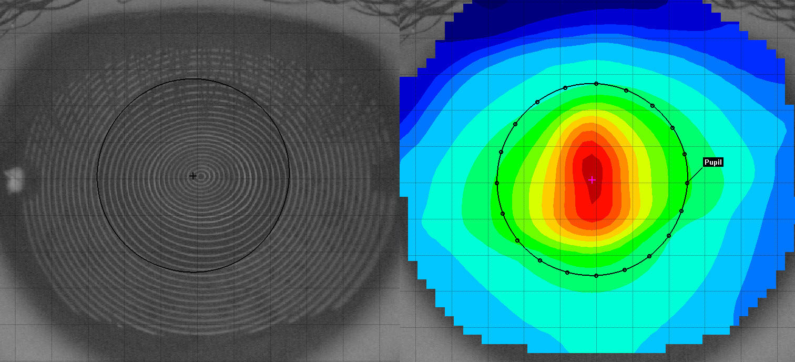

CAPTION: Corneal topography of keratoconic cornea

In contrast, these images are results from a topography taken of a significantly keratoconic eye. Note the distorted and compressed rings on the image on the left. The coloured contour maps of the same eye show a much darker red area over the centre of the eye, conveying the protrusion or ‘cone’ of the cornea. This is significant to vision quality as the distorted surface is within the pupil zone (the black circle).

#### Optical coherence tomography (OCT)

The OCT is an invaluable tool that allows practitioners to assess different layers of the eye as high-definition cross-sectional scans. This device was initially used to diagnose and manage macular degeneration and glaucoma at the back of the eye. More recent advancements in technology have enabled us to utilise the precision of these scans for assessment of the front portion of the eye: the cornea.

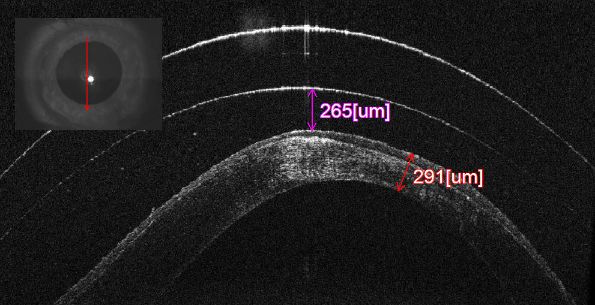

CAPTION: OCT of keratoconus with a scleral contact lens above. Normal corneal thickness is 550 microns. This cornea is singificantly thinner at 291 microns.

Due to the highly detailed images taken with an OCT, the different layers of the cornea are visible, as well as their configuration as the cornea protrudes forward (as shown above). As keratoconic eyes exhibit an overall thinning of the cornea at and around the cone, these layers are able to be measured and quantified to better monitor disease progression.

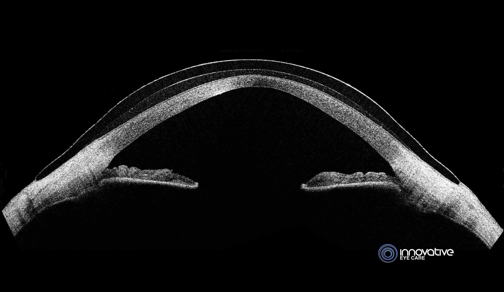

CAPTION: OCT of keratoconus with a scleral contact lens.

The OCT also helps us assess the relationship between contact lenses and the eye, to achieve the most ideal, comfortable and safe fitting contact lens. The above example of a custom scleral lens on the eye conveys adequate clearance over the cone and a nice smooth landing of the edge of the lens on the white part of the eye to ensure maximum comfort.

In rare situations someone with severe keratoconus can develop corneal hydrops, a condition where the posterior membrane of the cornea ruptures causing extreme corneal swelling, pain and ultimately scarring. Patients who have corneal hydrops often require a corneal graft due to the residual scarring.

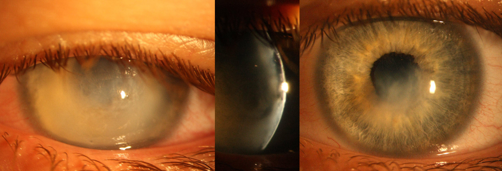

CAPTION: Corneal hydrops in a keratoconic patient of ours. The picture on the right is 6 months after the initial episode showing the residual corneal scar.

# How is keratoconus treated?

<iframe frameborder="0" type="text/html" src="https://2689-2347.captiv8online.com/animations/embed/one/corneal-cross-linking?player_width=100%&player_height=100%&site_company_language=34&autostart=false" width="100%" height="100%" style="position:absolute;top:0;left:0;width:100%;height:100%;"></iframe>

 

If keratoconus is diagnosed early enough, a new surgical technique called collagen cross-linking (CXL) is often recommended. For this procedure, riboflavin (Vitamin B2) is soaked into a keratoconic cornea and activated by UV light. This promotes cross-linking of the collagen fibrils in the cornea, leading to a strengthening of the tissue. Collagen cross-linking will not cure someone of keratoconus and it may not improve the vision, but should stabilise the cornea, decreasing the chance of further thinning and damage.17 If your cornea has become too thin (~400um) then CXL is too unsafe to be carried out, so early referral is important.18

If the cornea becomes too thin or scars excessively over time, not even a perfect fitting contact lens may provide clear enough vision. In these instances a corneal graft may be required. The longer this can be delayed with contact lens wear and careful management the better – grafts have a risk of rejection, require long courses of steroid drops, and often require spectacles or contact lenses to be used after the surgery to see to the best level.

It is important for keratoconic patients to be assessed and fitted by an experienced optometrist with a strong background of keratoconus management. Our optometrists Lachlan Hoy, Karl Evans and Joanna Rohrlach have an interest in contact lens fitting and have treated many patients over the years with irregular corneas. Poorly fitting contact lenses have been shown to promote the progression of the disease in some individuals, due to an increase in inflammatory factors released into the tear fluid.19 Poorly fitting contact lenses can also cause permanent vision loss by scarring the cornea.20 Our optometrists use <a href="http://innovativecontacts.com.au/">Innovative Contacts</a>, a rigid lens production and distribution company that supplies optometrists all over Australia with an array of contact lens solutions for a multitude of refractive diseases, including keratoconus.

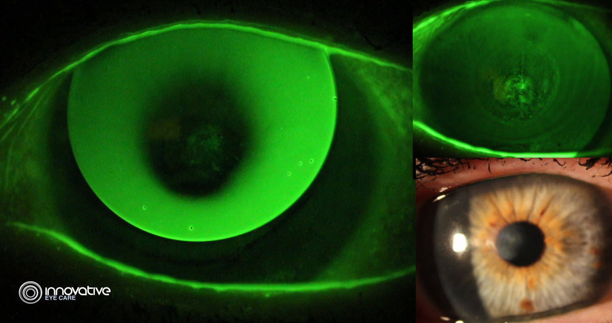

CAPTION: An example of a very poorly fitting RGP lens in a patient that was referred to us for management. This patient's lenses caused permanent corneal scarring (bottom right image) and needed a prompt refit into a scleral lens to rehabilitate the cornea.

#### Keratoconus vs. Pellucid Marginal Corneal Degeneration

Pellucid Marginal Corneal Degeneration is an uncommon condition causing thinning of the lower part of the cornea. This non-inflammatory condition is often confused with keratoconus as it causes similar distortion of the cornea and requires complex contact lens designs, typically in the form of scleral lenses, to give the best quality of vision. Patients between the ages of 20-50 will often present with blurred vision due to the irregularity of their cornea. Often against-the-rule astigmatism is present and contributes to the blur seen.  In PMCD, the stroma (collagen) of the cornea is abnormal and thin but the other parts of the cornea are unaffected and function normally. This degeneration can progress slowly over time, but will only very rarely progress to the point of perforating the cornea. 

PMCD is best managed with large diameter [scleral contact lenses](/what-we-do/scleral-contact-lenses) that will vault over the affected area of cornea and still provide a regular front surface for vision. In severe cases a [corneal graft](/what-we-do/corneal-grafts) may be needed to restore functional vision. Collagen cross-linking is a surgical procedure used in some progressive cases to prevent further worsening of the condition.

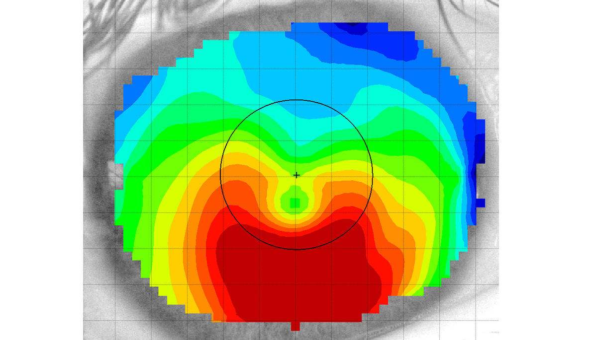

CAPTION: A corneal topography of a patient with PMCD showing the irregular steepening of the lower part of the cornea giving a typical 'crab-claw' appearance.

<b>References</b>

1. Lawless, M., Coster, D. J., Phillips, A. J., & Loane, M. 1989. Keratoconus: diagnosis and management. <i>Aust N Z J Ophthalmol</i>, 17, 33-60.

2. Gomes, J. A., Rapuano, C. J., Belin, M. W. & Ambrosio, R., Jr. 2015. Global Consensus on Keratoconus Diagnosis. <i>Cornea</i>, 34, e-38-9.

3. Hoy

4. Ortiz-Toquero, S., Perez, S., Rodriguez, G., De Juan, V., Mayo-Iscar, A. & Martin, R. 2016. The influence of the refractive correction on the vision-related quality of life in keratoconus patients. <i>Qual Life Res</i>, 25, 1043-51.

5. Bergmanson, J. P., Walker, M. K. & Johnson, L. A. 2016. Assessing Scleral Contact Lens in Satisfaction in a Keratoconus Population. <i>Optom Vis Sci</i>, 93, 855-60.

6. Kennedy, R. H., Bourne, W. M. & Dyer, J. A. 1986. Apical changes in scarring in keratoconus. <i>Am J Ophthalmol</i>, 101, 267-73.

7. Godefrooij, D. A., De Wit, G. A., Uiterwaal, C. S., Imhof, S. M. & Wisse, R. P. 2017. Age-specific Incidence and Prevalence of Keratoconus: A Nationwide Registration Study. <i>Am J Ophthalmol</i>, 175, 169-172.

8. Rabinowitz, Y. S. 1998. Keratoconus. <i>Survey of Ophthalmology</i>, 42, 297-319.

9. Li, X., Rabinowitz, Y. S., Rasheed, K. & Yang, H. 2004. Longitudal study of normal eyes in unilateral keratoconus patients. <i>Ophthalmology</i>, 111, 440-6.

10. Karimian, F., Aramesh, S., Rabei, H. M., Javadi, M. A. & Rafati, N. 2008. Topographic evaluation of relatives of patients with keratoconus. <i>Cornea</i>, 27, 874-8.

11. Balasubramanian, S. A., Pye, D. C. & Willcox, M. D. 2013. Effects of eye rubbing on levels of protease, protease activity and cytokines in tears: relevance in keratoconus. <i>Clin Exp Optom</i>, 96, 214-8.

12. Lawless, M., Coster, D. J., Phillips, A. J., & Loane, M. 1989. Keratoconus: diagnosis and management. <i>Aust N Z J Ophthalmol</i>, 17, 33-60. 

13. Romero-Jimenez, M., Santodomingo-Rubido, J. & Wolffsohn, J. S. 2010. Keratoconus: a review. <i>Contact Lens and Anterior Eye</i>, 33, 157-166. 

14. Gokul, A., Patel, D. V., Watters, G. A. & McGhee, C. N. J. 2017. The natural history of corneal topographic progression of keratoconus after age 30 years in non-contact lens wearer. <i>Br J Ophthalmol</i>, 101, 839-844.

15. Romero-Jimenez, M., Santodomingo-Rubido, J. & Wolffsohn, J. S. 2010. Keratoconus: a review. <i>Contact Lens and Anterior Eye</i>, 33, 157-166. 

16. Rabinowitz, Y. S. 1998. Keratoconus. <i>Survey of Ophthalmology</i>, 42, 297-319.

17. Goodefrooij, D. A., Gans, R., Imhof, S. M. & Wisse, R. P. 2016. Nationwide reduction in the number of corneal transplantations for keratoconus following the implementation of cross-linking. <i>Acta Ophthalmol</i>, 94, 675-678.

18. Galvis, V., Tello, A., Ortiz, A. I. & Escaf, L. C. 2017. Patient selection for corneal collagen cross-linking: an updated review. <i>Clin Ophthalmol</i>, 11, 657-668.

19. Macsai, M. S., Varley, G. A. & Krachmer, J. H. 1990. Development of keratoconus after contact lens wear. Patient characteristics. <i>Arch Ophthalmol</i>, 108, 534-8.

20. Korb, D. R., Finnemore, V. M. & Herman, J. P. 1982. Apical changes and scarring in keratoconus as related to contact lens fitting techniques. <i>J Am Optom Assoc</i>, 53, 199-205.
