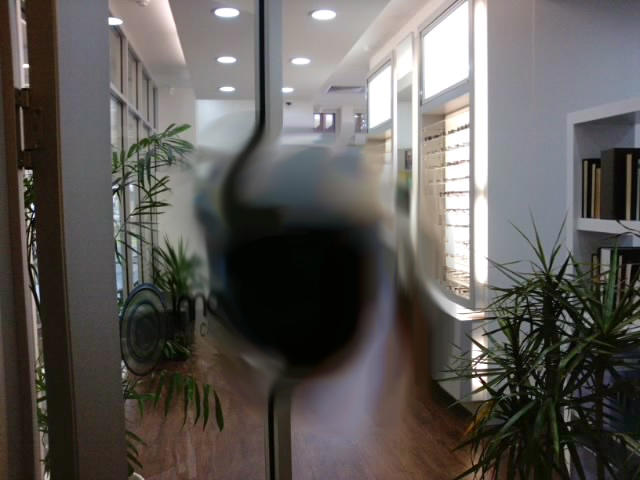
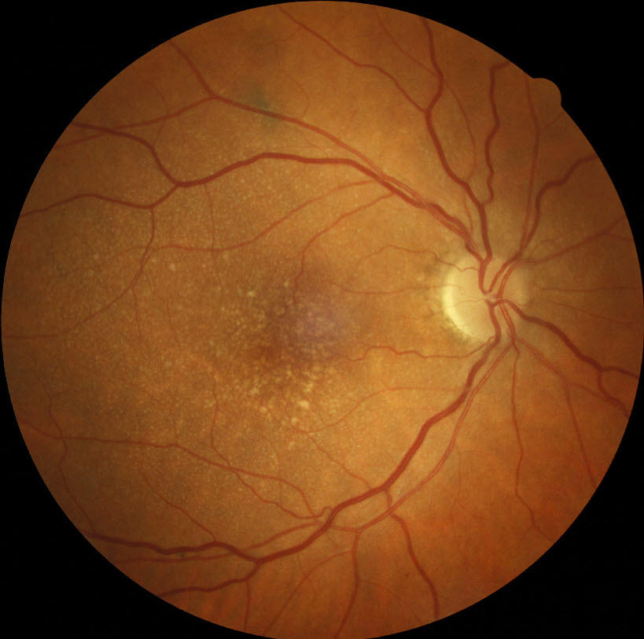
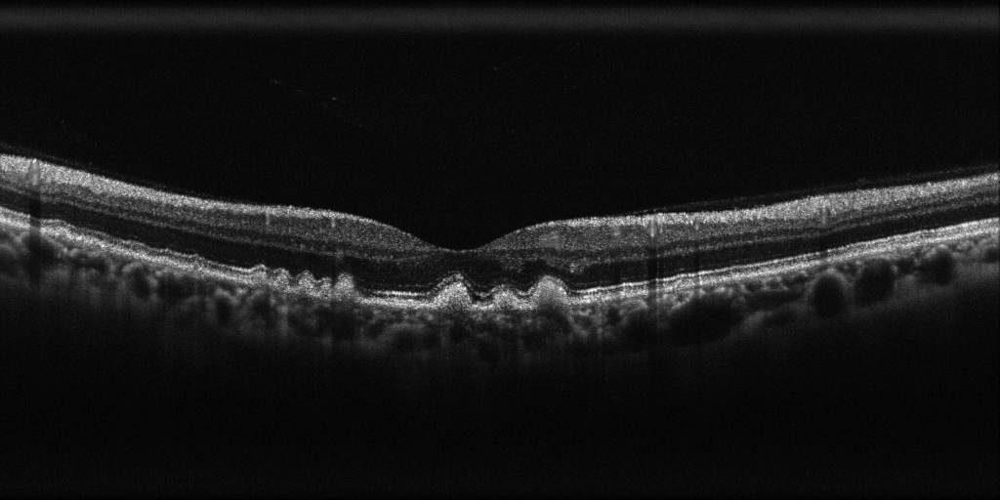
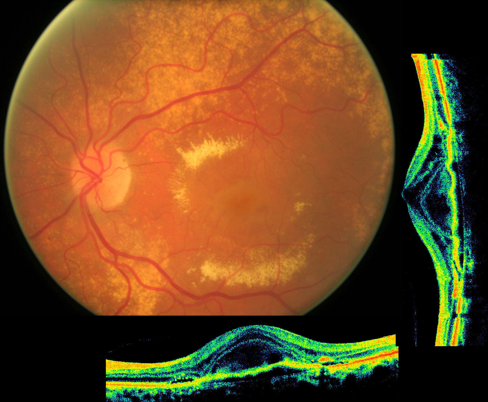

Age-related macular degeneration is a progressive disease of the part of our eye's retina that gives us our detailed vision. The latest research shows that only 8% of Australians are able to correctly identify a symptom of macular degeneration, an alarming statistic considering this eye disease affects one in seven Australians over the age of 50. Education is key to early detection and prevention of excessive vision loss as the disease progresses.

If you are interested in knowing more about macular degeneration, <a href="/contact">contact</a> our friendly staff or book an <a href="/what-we-do/eye-exam">eye test</a> for macular degeneration diagnostics and management options.

# What is macular degeneration?

Age-related macular degeneration (ARMD or AMD) is a progressive eye disease that causes breakdown of the central part of the retina, known as the macula. The macula is responsible for a person’s central vision, colour vision, and fine detailed vision; however, it does not have an affect on your peripheral vision. 

CAPTION: A simulation of the type of central vision loss that may occur in ARMD

# What are the types of age related macular degeneration?

#### Dry AMD

The more common and less advanced of the two types, it affects 85 to 90 percent of people with AMD. Changes typically occur slowly, so individuals with noticeable symptoms would report the gradual dark or blurred spot in their central vision. 

<!--[if IE]><iframe frameborder="0" type="text/html" src="https://2689-2347.captiv8online.com/animations/embed/one/d-l-t-d-m-ul-d-t-o?player_width=100%&player_height=100%&site_company_language=34&autostart=false" width="100%" height="100%" style="position:absolute;top:0;left:0;width:100%;height:100%;"></iframe><![endif]--><!--[if !IE]> <--><object data="https://2689-2347.captiv8online.com/animations/embed/one/d-l-t-d-m-ul-d-t-o?player_width=100%&player_height=100%&site_company_language=34&autostart=false" type="text/html" width="100%" height="100%" style="position:absolute;top:0;left:0;width:100%;height:100%;">  alt : <a href="https://2689-2347.captiv8online.com/animations/embed/one/d-l-t-d-m-ul-d-t-o?player_width=100%&player_height=100%&site_company_language=34&autostart=false">AMD: Dry</a></object><!--> <![endif]-->

 

#### Wet AMD

This is the advanced stage of this disease. It is characterised by abnormal blood vessel growth behind the macula. These vessels may leak blood or fluid, which causes the macula to lift from its normal location. This results in straight lines and objects appearing curved or wavy. Objects such as vertical blinds, door frames, and flagpoles appear distorted as a symptom of wet macular degeneration. Compared to dry AMD, wet AMD causes more rapid and dramatic decreases in central vision.

<!--[if IE]><iframe frameborder="0" type="text/html" src="https://2689-2347.captiv8online.com/animations/embed/one/t-l-t-d-m-ul-d-t-o?player_width=100%&player_height=100%&site_company_language=34&autostart=false" width="100%" height="100%" style="position:absolute;top:0;left:0;width:100%;height:100%;"></iframe><![endif]--><!--[if !IE]> <--><object data="https://2689-2347.captiv8online.com/animations/embed/one/t-l-t-d-m-ul-d-t-o?player_width=100%&player_height=100%&site_company_language=34&autostart=false" type="text/html" width="100%" height="100%" style="position:absolute;top:0;left:0;width:100%;height:100%;">  alt : <a href="https://2689-2347.captiv8online.com/animations/embed/one/t-l-t-d-m-ul-d-t-o?player_width=100%&player_height=100%&site_company_language=34&autostart=false">AMD: Wet</a></object><!--> <![endif]-->

 

# How is macular degeneration diagnosed?

When your optometrist examines your eyes they will be able to tell you if you have signs of macular degeneration. Early on this will be in the form of drusen - a build up of waste material beneath the retina. With time, this drusen may enlarge or atrophy, causing the vision loss associated with dry ARMD.

The technology available at Innovative Eye Care, including [retinal photography](/what-we-do/retinal-photography) and [OCT scans](/what-we-do/oct), are very useful to diagnose and monitor the changes associated with ARMD.

CAPTION: Typical appearance of mild drusen (yellow speckles) seen with retinal photography (early ARMD)

CAPTION: Optical Coherence Tomography showing build-up of mild drusen under the macula (early ARMD)

# What is the treatment for ARMD?

#### Dry ARMD Treatment

Treatment options for dry macular degeneration are very limited. Specific anti-oxidant and vitamin supplements based on the AREDS trial (such as Macuvision) have been shown to slow the progression of this form of the disease. Avoidance of smoking and alcohol is also very important. Visit our [nutrition page](/patient-resources/nutrition-and-supplements-for-age-related-macular-degeneration) for more information about this. However, about 10 to 15 percent of dry macular degeneration cases progress into wet AMD. 

#### Wet ARMD Treatment

If there is fluid or blood beneath or within the retina, early detection is key to improve the chance of visual recovery. Your optometrist will give you an Amsler grid to take home if you are risk of wet ARMD. This grid should be checked in each eye every day to looks for signs of subtle distortion or loss of vision typical of early wet ARMD. If these changes are noticed, your eyes should be promptly tested by your optometrist for changes at the macula. Given early detection is critical to saving sight, a lack of symptom recognition could risk blindness.

CAPTION: Amsler Grid used to test for the onset of wet ARMD

If wet ARMD is diagnosed by your optometrist, injections from an eye surgeon are often required to decrease the growth of new vessels within the eye. With time, this helps stop the swelling, and in most cases returns the vision to a reasonable level.

CAPTION: A case of wet ARMD showing swelling at the macula in the retinal photograph and this retina in cross-section on the coloured Optovue OCT images

# What happens after ARMD starts affecting my vision?

ARMD is a common cause of low vision and blindness in older Australians. Fortunately, in most cases it will take many years for ARMD to start causing significant vision loss. 

Even with the vision changes associated with ARMD, there are many tools your optometrist can prescribe to allow you to still go about your daily life. This may include optical aids including magnifiers, telescopes, high powered reading glasses and digital equipment to magnify print. Often patients will benefit from help from the Royal Society for the Blind ([www.rsb.org.au](http://www.rsb.org.au)) to assist with counselling, lifestyle training, and a range of other services. You will need a referral from your optometrist to become a member of RSB. Ask your optometrist if you have any questions about these aspects of ARMD management.
