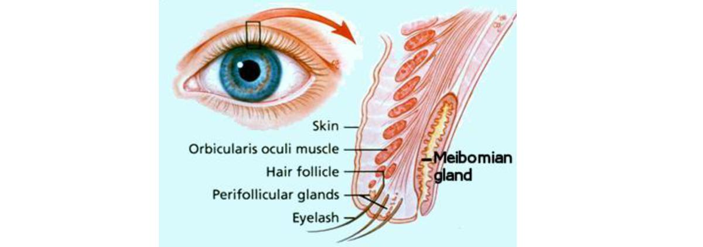
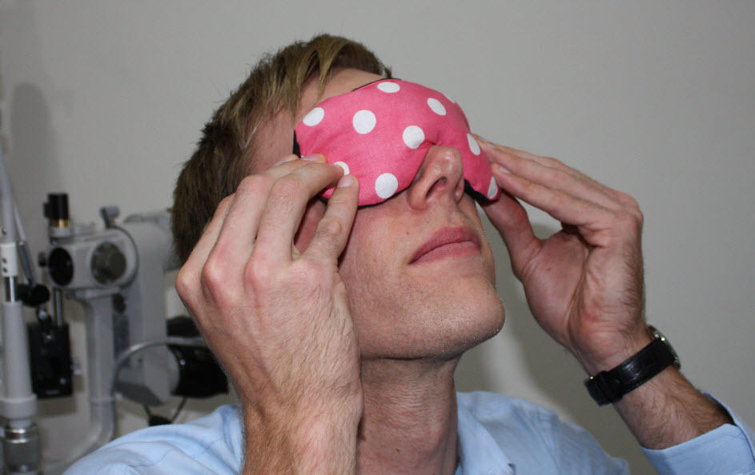

Meibomian glands are the oil-producing glands located in both the upper and lower eyelids. When these become chronically blocked, which occurs in about 30% of the population,  increased evaporation of the watery component of tears occurs, causing the symptoms of irritation and dryness. This condition is called meibomian gland dysfunction (MGD), and is also known posterior blepharitis. MGD is one of the most common conditions our optometrists in Adelaide and Woodville treat. If you are interested in knowing more about MGD, <a href="/what-we-do/eye-exam">book an appointment</a> or contact us.

#### What is Meibomian Gland Dysfunction?

When the meibomian glands number about 25 to 30 and normally slowly release oil into the tear film. This oil/lipid helps to stop the watery component of the tears from evaporating, thus helping to prevent dry eyes.

CAPTION: Figure 1: Meibomian Glands

Sometimes the oil becomes slightly thicker than normal which can lead to blockage of the narrow duct which takes the oil from the gland to the tear film. Dry eye and irritation occur as the stabilising oil cannot reach the tear film. This is called Meibomian Gland Dysfunction (MGD) and is also referred to as posterior blepharitis, as naturally occurring bacteria can cause the oils to thicken and stagnate.

Severe blockage can lead to much enlarged glands (a cyst) or even infection. It is therefore important to firstly unclog the blocked glands, and secondly prevent them from blocking up again - as much as possible.

CAPTION: Examples of heated eye bags used for MGD compresses. They are filled with wheat or Bruder medibeads.

## At home Meibomian Gland Expression

The first step in unblocking the glands is to liquefy the thickened oil in them. This is achieved with a hot facecloth against the closed eye for a minute or so. A heated wheat bag can be used instead for better heat transfer. These are available at Innovative Eye Care. Some patients prefer to use the warmth of their shower to heat up the glands.

CAPTION: Figure 2: Liquefying the thickened oil with a heated wheat bag

After liquefying the oils with this warming, place your index finger on your cheek and press firmly at the edge of the lower lid, rolling your finger upwards to ‘milk’ the gland and empty its contents out of the lid (Fig 3). The picture below shows this technique. 

CAPTION: Figure 3: Emptying the glands

  * Repeat this process few times across the entire lower eyelid, then the upper eyelid. 
  * Repeat the entire procedure for the other eye.
  * Do this twice per day for two weeks. This will help to unclog the blocked glands. 
  * After this period, repeating the procedure just once per day should help to prevent the glands from becoming re-blocked.
  * If you stop hot compresses all together, MGD will recur because it is a chronic condition – this is why it is important to make the compresses part of your daily routine.

## In-Office Meibomian Gland Expression 

If the MGD is more severe, some patients’ glands will initially need a little more help to become unblocked. This can be done by your optometrist with the aid of a meibomian gland expression paddle (Mastrota paddle). Generally this will only require a 15 minute appointment. This in-office expression is more effective than just normal hot-compresses and massage at home. Some patients prefer having this procedure every few months due to the long-term relief it provides.

## IPL treatment for MGD

An exciting new treatment for MGD is now available at Innovative Eye Care. Intense Pulsed Light treatment shows exciting promise for patients with MGD. It involved three treatments over the course of 6 weeks at the clinic with your optometrist. For more information please visit our IPL treatment page [here](/what-we-do/ipl-treatment-for-meibomian-gland-dysfunction).

## Therapeutic Intervention for MGD

There are several therapeutic options which are useful in MGD management:

  * **Systane Balance** eye drops have been formulated to provide relief for MGD patients. These drops have an oil component that helps to stabilise the lipid layer of the tear film and prevent evaporation. They can be used twice a day or when required, for up to 6 months after the bottle is opened. 

  * **Optimel** is an ophthalmic ointment derived from antibacterial manuka honey. In MGD there is often an overgrowth of natural bacterial flora which affects meibomian gland secretions. Using this new product can decrease the overgrowth and restore normal meibomian gland function. Recommended dosage is a small 2mm amount placed under the bottom lid three times a day. Due to its nature, Optimel is preservative free. Be aware that it does sting a little on insertion! The eye drop form of optimel has a lower concentration of the active component, but it does sting a little less! Find [Optimel Antibacterial Manuka Eye Drops at our shop.](http://eyesolutions.com.au/collections/dry-eye-treatments/products/optimel-antibacterial-manuka-eye-drops)

  * **Oral antibiotics**, such as doxycycline, used at a low dosage (50mg a day) in conjunction with your GP have been show to have an anti-inflammatory effect which helps MGD patients improve their gland function. Oral antibiotics are generally only reserved for moderate to severe forms of the conditions that do not respond to other treatments. Ask your optometrist if you need oral antibiotics for your MGD before commencing treatment.

There are constant updates in the field of MGD research and treatments. Be sure to ask your optometrist if you have any questions about your recommended treatment.
