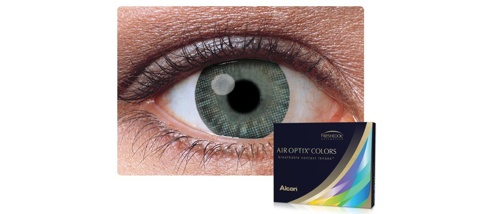

Novelty and coloured contact lenses can be a great idea for social events. Proper insertion, removal and care are vital to protect your eye health and safety. At Innovative Eye Care we offer fitting appointments so that you are well-equipped to safely enjoy your novelty or coloured contact lenses!

At Innovative Eye Care the majority of the contact lenses we prescribe are designed for patients to improve their vision. However, there are some varieties of contact lenses that exist to change the look or colour of your eyes for cosmetic reasons or for social occasions − these can be great fun to use! 

Recently, the first high oxygen-permeable silicone hydrogel coloured contact lens was released, meaning that your cornea will still be able to 'breathe' when coloured lenses are being worn.

It is important to remember that all contact lenses, including novelty contact lenses, can harm your eyes if not used correctly. In South Australia, legislation states that novelty contact lenses can only be ordered through your optometrist. This is in response to numerous examples of serious vision loss due to misuse. At Innovative Eye Care we believe that a contact lens, whatever its use, is a medical device. It should therefore be fitted by an optometrist with proper training provided to the patient on insertion, removal and correct contact lens hygiene. Some coloured and novelty contacts can also come in your prescription which can be assessed by your optometrist. 

Some key points about coloured and novelty contact lenses:

  * These lenses require good contact lens habits like normal soft disposable lenses: see our [Care of Soft Disposable Contact Lenses page](/patient-resources/care-of-soft-disposable-contact-lenses). Most importantly, the lenses should be cleaned and sterilised between uses and replaced every month.
  * Coloured contact lenses are NOT approved for overnight wear as they may place your eye more at risk of infection or painful inflammation.
  * Never share contact lenses with friends or family members; this practice may allow bacteria to be transmitted from eye to eye, potentially causing problems.

If your eyes are red or sore after wearing coloured or novelty contact lenses, promptly visit your optometrist. 

Here are some examples of one brand's coloured contact lens designs. Visit www.colourvue.net.au to browse the different styles and colours available.
