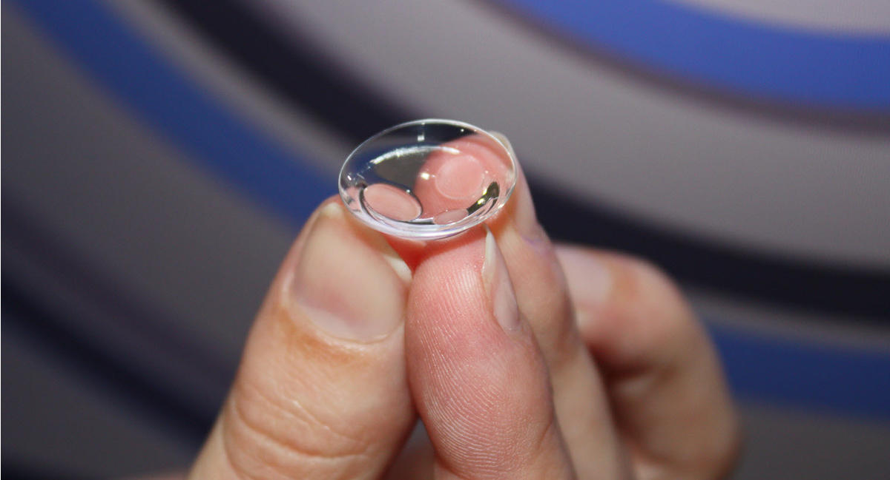
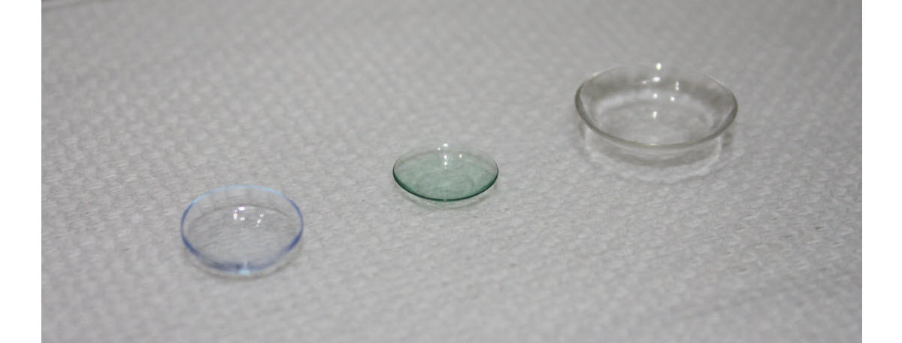

There are are a variety of corneal conditions that are best managed with specialised custom contact lenses. These include keratoconus, pellucid marginal degeneration, corneal grafts, corneal dystrophies, corneal scarring from injury, and post-refractive surgery ectasia.

Innovative Eye Care’s Platinum Custom Lens Fitting Plan sets a new benchmark for contact lens fitting for corneal disease in Australia as it significantly improves the likelihood of successfully wearing contact lenses, especially for patients who have failed in previous contact lens designs or who are yet to use contact lenses for their corneal condition. 

# Platinum Custom Contact Lens Fitting Plan for Corneal Disease

Innovative Eye Care’s Platinum Custom Contact Lens Fitting Plan sets a new benchmark for contact lens fitting for corneal disease in Australia. It significantly improves the likelihood of successfully wearing contact lenses. This is because it allows us to swap to different types of contact lenses or different parameters to solve problems as they arise. The plan removes the uncertainty of choosing an initial contact lens design. It also negates the difficulty that can occur when the usual 3 month warranty limit has been reached if comfortable all-day contact lens wear has yet to be achieved. We have removed the limit on the number of exchanges or designs that can occur to refine a contact lens fitting, and increased the warranty period to 12 months. This liberates us as practitioners to be able to provide the best contact lenses we can for your eyes. 

Innovative Eye Care’s Platinum Custom Contact Lens Fitting Plan should be selected in consultation with your contact lens practitioner. It is strongly recommended if you have not worn rigid lenses for corneal disease before, or have previously been unsuccessful with rigid lenses. The Platinum Rigid-Lens Fitting Plan needs to be selected before contact lenses are fitted or prescribed.

# Successful contact lens wear for corneal disease

Even with the best efforts of the practitioner and patient, a particular custom contact lens design may be unsuccessful in certain patients with complex eyes. This may occur despite an excellent contact lens fitting, and can simply be due to intolerance or difficulty handling the contact lenses. Issues with lens design may not be immediately evident, as ordering exchange contact lenses and adapting to a new design can take some time. To better suit patients with corneal disease, we can provide a longer warranty exchange period than the usual 3 months, ensuring the best chance of ultimate success. 

A successful contact lens fit means that the contact lenses can be worn all day with good comfort, excellent vision, good stability and healthy eyes. Even more importantly, success means avoiding an unnecessary [corneal graft](/what-we-do/corneal-grafts), which can be a long-term consequence of corneal disease. Despite corneal grafts generally being very successful in restoring vision, some patients struggle to achieve comfortable clear vision following the graft, with or without RGP contact lenses. Rejection of the corneal graft is a constant possibility and increases with the age of the graft. The survival rate of corneal grafts is 75% after 15 years. A lens that fits sub-optimally or is used incorrectly may increase the chance of a corneal graft being needed later in life, making it even more critical to ensure the best contact lens fit is achieved.

[Keratoconus](/what-we-do/keratoconus) is the most common condition we fit specialised custom contact lenses for. In this condition, the irregular distortion of the cornea limits the quality of vision achievable with spectacles or soft contact lenses. Wearing a smooth rigid contact lens over the cornea allows the tears to fill in the space between the rigid surface and the corneal irregularity, neutralising the majority of the corneal distortion. The substantial reduction in image distortion gives better definition and contrast, which improves vision and decreases ghosting. There is a variety of different custom contact lens types available including:

  * [Rigid corneal lenses](/what-we-do/gas-permeable-contact-lenses)
  * [Scleral lenses](/what-we-do/scleral-contact-lenses)
  * Hybrid lenses
  * Customised [soft lenses](/what-we-do/soft-disposable-lenses)

# Details of the Platinum Custom Contact Lens Fitting Plan

  * The Platinum Custom Contact Lens Fitting Plan period lasts for 12 months and commences at the first contact lens fitting consultation. There is no restriction on the number of consultations.
  * All contact lenses ordered under our Platinum Custom Contact Lens Fitting Plan are covered for breakage but not for loss during the warranty period. 
  * During the warranty period all accessories (such as ocular lubricant drops, lens applicators) and contact lens solutions are included in the cost.
  * Once a successful lens has been found, a back-up lens for each eye will be included.
  * A medicare rebate may be applicable for the consultations. We can establish eligibility at your first contact lens fitting consultation
  * Private Health Cover with Extras will usually provide a rebate for lenses, ranging from $80-300. Please check with your health fund to determine level of cover
  * At the conclusion of your 12 month plan most patients are happily settled into their routine of contact lens wear and solution use. We then recommend regular 6 month reviews with the cost of consultations, lenses and solutions arranged on an as-needed basis.

## Cost of the Platinum Custom Contact Lens Fitting Plan 

The cost of Innovative Eye Care’s Platinum Custom Contact Lens Fitting Plan is as follows:

  * Both eyes: $2,500
  * Single eye: $1250
  * Student/concession for both eyes: $2125 (10% discount)
  * Student/concession for single eye: $1065 (10% discount)

If you elect to have your contact lenses fitted in the conventional manner you will be responsible for the cost of any spare lenses, all solutions and drops and any consultation time outside the initial fitting period. Also if your lens type is not best suited to your eyes you may be responsible for the cost of switching to a different lens type if this is out of warranty (typically 3 months).
