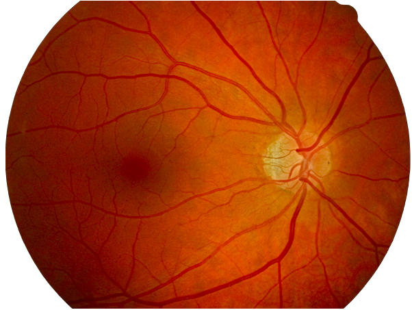
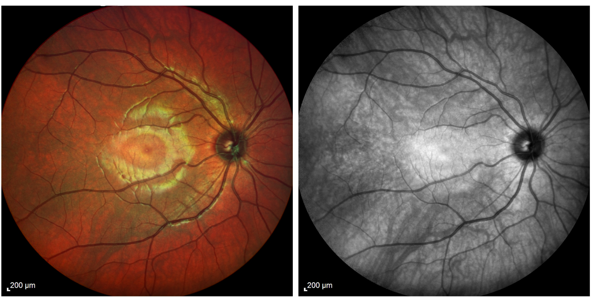
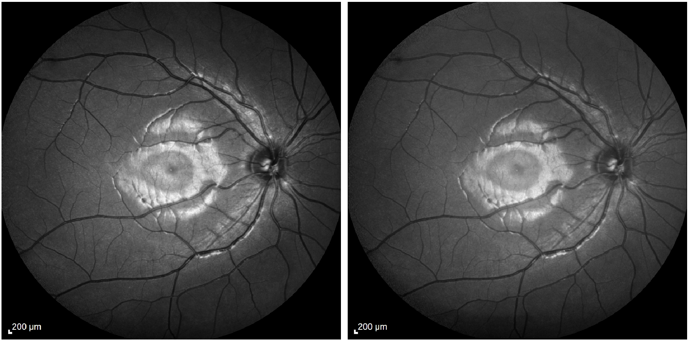
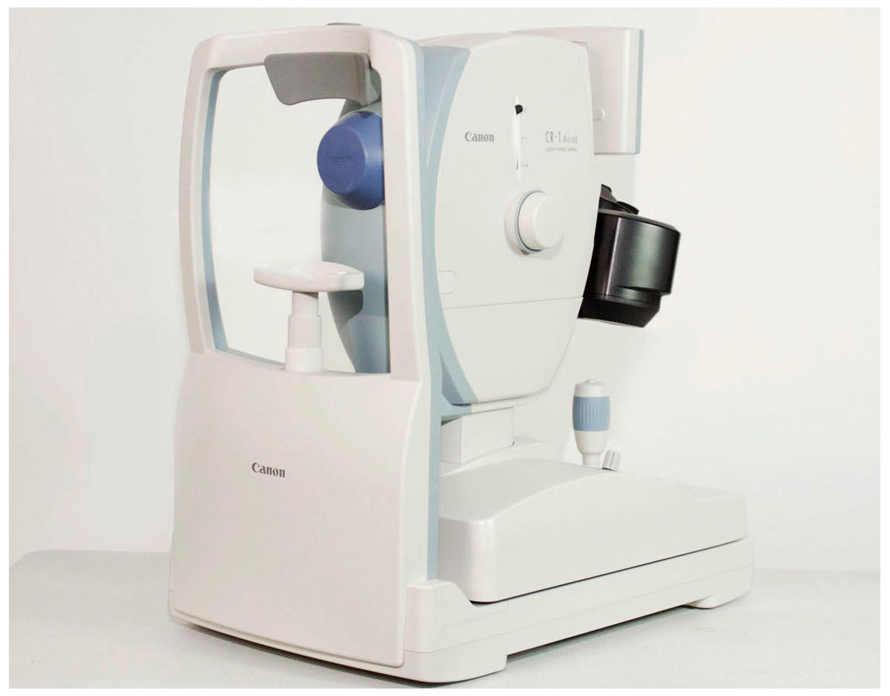
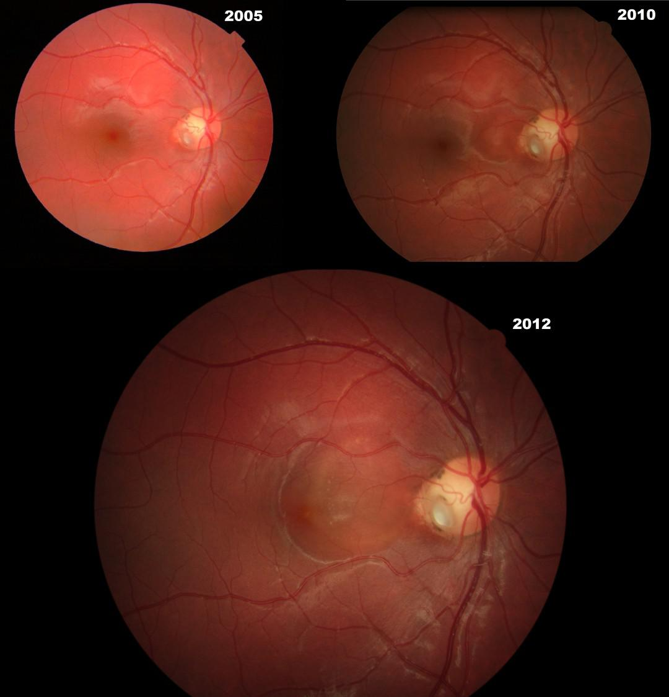

At Innovative Eye Care, your optometrist will take retinal photographs of your eyes using one of two state-of-the-art retinal cameras depending on whether your appointment takes place at our Adelaide or Woodville branch. This process is important as part of your <a href="/what-we-do/eye-exam">comprehensive eye examination</a> and is used to monitor any changes to your eye health in the future.

The real value of retinal photography is that it provides a baseline for the condition of your eye, making future changes much easier to monitor. This technology is especially useful in slow moving pathological processes such as in [glaucoma](/what-we-do/glaucoma), [macular degeneration](/what-we-do/macular-degeneration) and [diabetic retinopathy](/what-we-do//what-we-do/diabetes-and-the-eye). We believe it is important to have a retinal photograph taken at your initial consultation and then regularly in the future, even if your eyes look normal like the image below. Please be aware that retinal photography does not attract a Medicare rebate so a small extra charge for this service will apply (we are happy to offer 50% off this price for pensioners and students). 

CAPTION: Fundus photo of a normal healthy eye

#### Heidelberg Spectralis

The Heidelberg Spectralis has the ability to take crystal clear wide-angle photos of the back of the eye by compiling multiple images taken during a 10-20 second scan, capturing an image of the optic nerve, the macula, and the areas beyond. MultiColor photos are also available, using laser imaging on three wavelengths to reveal different layers of the retina.

Both of these types of scans reveal structures and abnormalities of the eye that allow your optometrist to better pinpoint and manage eye health issues, if any, that can be detected using posterior imaging. These methods of diagnostic imaging are offered at our Adelaide practice.

CAPTION: Spectralis imaging of a healthy retina with MultiColor (top left), infrared light (top right), green reflectance (bottom left) and blue reflectance (bottom right).

#### Canon Non-Mydriatic Retinal Camera

Our high-resolution Canon digital retinal camera allows us to take a high-quality photograph of the back of your eye. This allows a more detailed, wider-angled view than would normally be achieved with conventional observation methods, such as a slit lamp, and allows us to store and record visual details of your eye to monitor progression.

Fundus photography is offered as part of our diagnostic imaging which incurs a secondary standard charge of $70 or $35 for concession card holders and children.

CAPTION: Retinal photographs of a young medical student over three time periods. Her congenital optic disc pit slowly caused a serous retinal detachment in her right eye, affecting her central vision.
