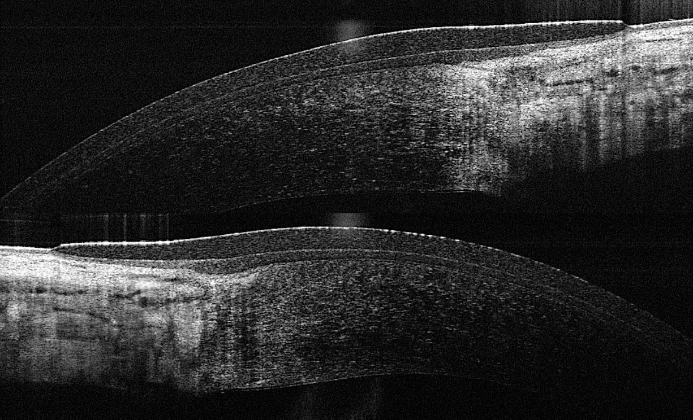

Soft disposable contact lenses offer clear vision without wearing spectacles. They have high comfort levels and a low risk of infection, along with being easy to insert and remove. Soft disposables come in daily and fortnightly/monthly types. To learn more about whether soft contact lenses are right for you, take a look at our general information page on <a href="/what-we-do/contact-lenses">contact lenses</a> or book an <a href="/what-we-do/eye-exam">appointment</a> with us today.

<!--[if IE]><iframe frameborder="0" type="text/html" src="https://2689-2347.captiv8online.com/animations/embed/one/cl-comp?player_width=100%&player_height=100%&site_company_language=34&autostart=false" width="100%" height="100%" style="position:absolute;top:0;left:0;width:100%;height:100%;"></iframe><![endif]--><!--[if !IE]> <--><object data="https://2689-2347.captiv8online.com/animations/embed/one/cl-comp?player_width=100%&player_height=100%&site_company_language=34&autostart=false" type="text/html" width="100%" height="100%" style="position:absolute;top:0;left:0;width:100%;height:100%;">  alt : <a href="https://2689-2347.captiv8online.com/animations/embed/one/cl-comp?player_width=100%&player_height=100%&site_company_language=34&autostart=false">Compliance</a></object><!--> <![endif]-->

 

#### What are soft contact lenses?

Soft contact lenses provide clear vision and lens wetability, and they are generally comfortable enough to wear all day. Most of these lenses are disposable, designed to be replaced after a prescribed time, generally daily or monthly. Unfortunately, due to their nature, soft contact lenses tend to tear more easily and can pose a risk of infection to the eyes if they are not handled correctly. If looked after properly then this risk is very low. Soft contact lenses can correct a range of prescriptions including [myopia](/what-we-do/myopia), [hyperopia](/what-we-do/hyperopia), [astigmatism](/what-we-do/astigmatism) and [presbyopia](/what-we-do/presbyopia).

They are made from a polymer-plastic material combined with water. The water content varies with different lenses. Newer generation soft lenses are made out variants of a material called silcone-hydrogel, this material allows more oxygen to pass through it better, allowing the cornea to 'breathe' and preventing some of the ocular health issues that older lens materials would cause. 

#### What types of soft contact lenses are there?

Silicone-hydrogels are available in daily and monthly modalities. Daily lenses are generally your optometrist's first choice for your eyes as they are a fresh, clean lens in your eyes everytime and there is less risk of microbial build up. They are also very convenient for travel and sports due to the lack of cleaning required. Monthly lenses are slightly more affordable than dailies on a per-day basis but do require careful cleaning each night to ensure your eyes remain healthy. 

#### How do I know if soft contact lenses are right for me?

Soft lenses are perfect for people with a range of refractive conditions who like the convenience of a disposable lens. A list of advantages and disadvantages of soft disposable lenses can be found [here](/what-we-do/contact-lenses). If you are interested in knowing what is involved in owning soft lenses, take a look at [this page](/patient-resources/care-of-soft-disposable-contact-lenses) on caring for soft lenses, and [this page](/patient-resources/tips-for-long-term-success-with-your-soft-disposable-contact-lenses) on long-term success with soft lenses.

#### What are the alternatives to soft lenses?

At Innovative Eye Care, we offer alternatives to soft lenses. Each individual person has a unique set of requirements for clear vision and comfort, and soft lenses may not always be suitable. Other possibilities include [rigid lenses](/what-we-do/rigid-gas-permeable-contact-lenses), [scleral lenses](/what-we-do/scleral-contact-lenses) and [orthokeratology](/what-we-do/orthokeratology-corneal-reshaping). There are also a range of treatments for specific conditions such as [myopia control](/what-we-do/myopia-control).

CAPTION: An OCT scan of a daily disposable contact lens on the cornea. Note the thin profile of the lens which affords such good comfort during wear
